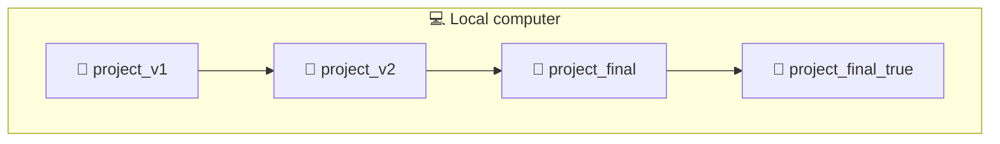
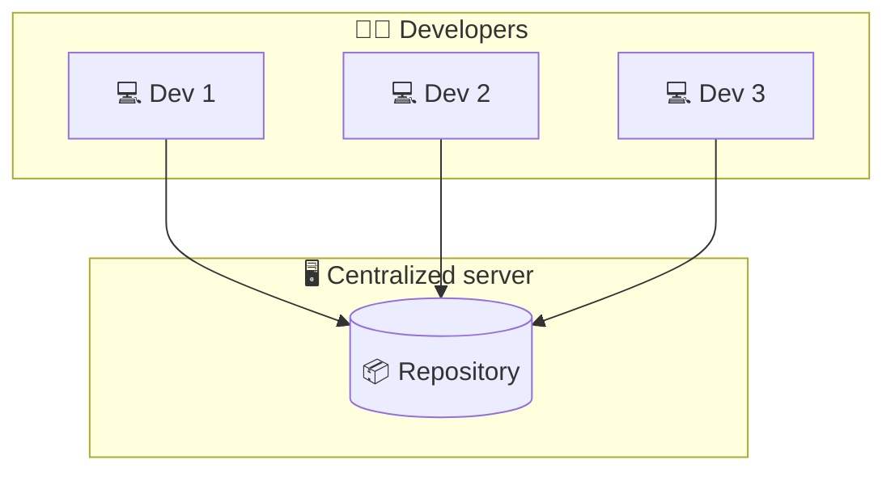
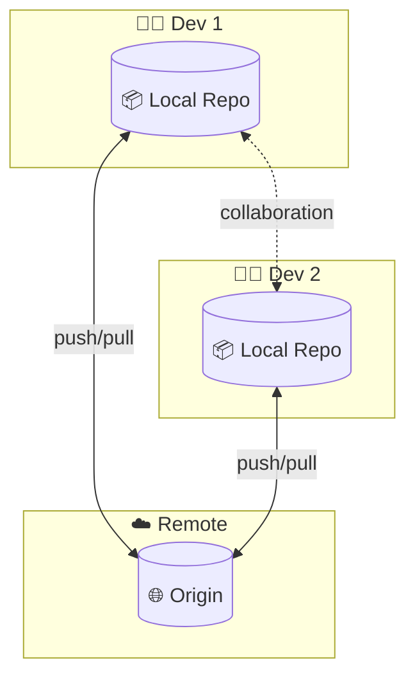
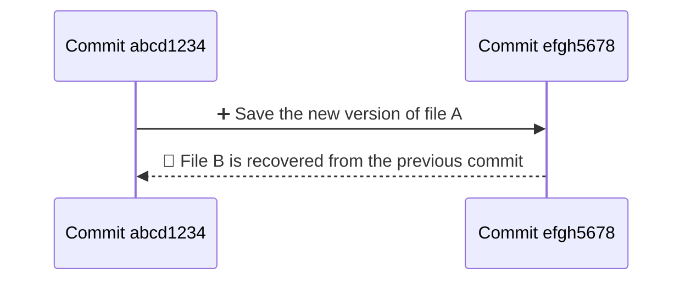
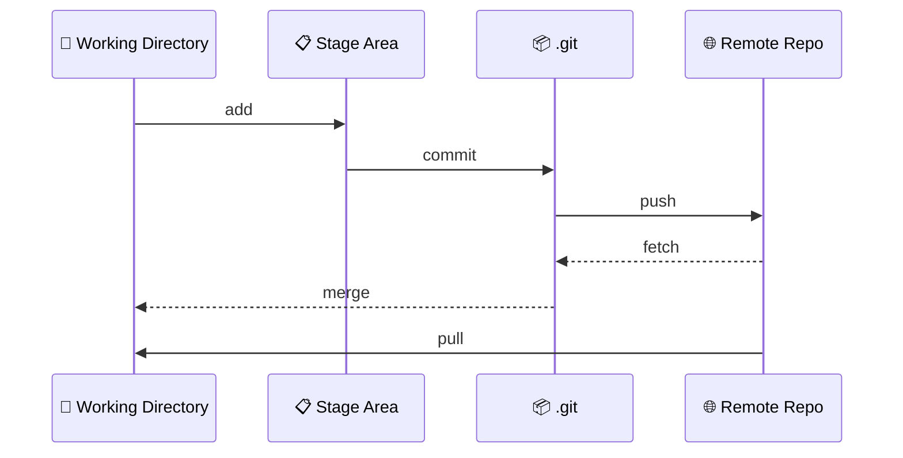
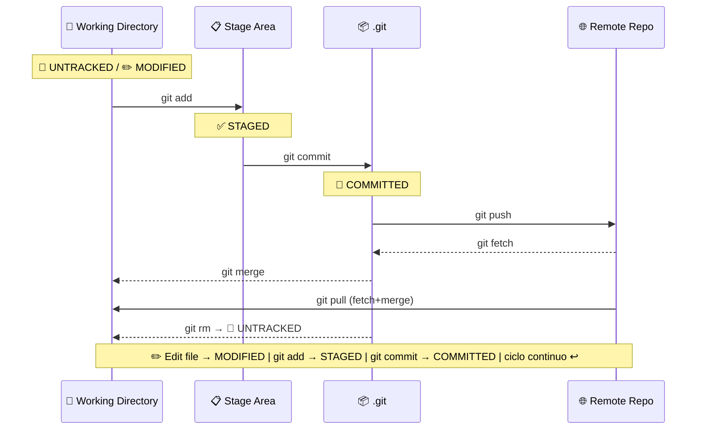
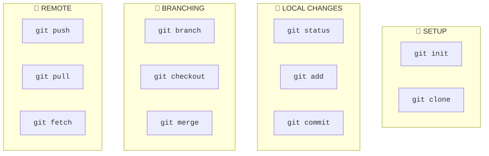

Version Control System
======================================================================

A **Version Control System (VCS)** is a system that records changes to one or more files over time. The advantages are as follows:

- 📜 **Track the history** of every change.
- ⏪ **Revert** to previous versions.
- 👥 **Collaborate** with other developers.
- 🔀 **Manage parallel versions** of the code.
  
  

Types of VCSs
----------------------------------------------------------------------

### Local Version Control Systems

It involves copying files to a local folder. It's simple but risky and not suitable for collaboration.




### Centralized Version Control Systems

They use a single central server to store all files and versions. Compared to a local system, it allows collaboration but has risks (single point of failure, network dependency). For many years, it was the standard.




### Distributed Version Control Systems (DVCS) ✅

Each developer has a **full copy** of the repository. Example: **Git**. **Advantages**: offline work, distributed backups.



Git
======================================================================

Git is a **DVCS** created by Linus Torvalds in 2005 to manage Linux kernel development.

- Each version of a project contains a copy of the modified files and, for other files, a reference to the previous one.
- Each version (or *commit*) is identified by a 40-character hash code: usually the first 8 are used.
- Each commit is saved in the hidden **.git** folder, called the local repository.
- The local repo is not the local working directory: Git doesn't save anything until the changes are committed.
- It works well with text files (e.g., .txt, .py, .json, .tmdl, etc.) but not so well with binary files (e.g., .docx, .pbix).




Git Areas & State of Files
----------------------------------------------------------------------



| Area                     | Descrizione                       | Comando                                                                      |
| ------------------------ | --------------------------------- | ---------------------------------------------------------------------------- |
| 📁 **Working Directory** | The files you are working on      | -                                                                            |
| 📋 **Staging Area**      | Changes selected for next commit  | `git add`                                                                    |
| 📦 **.git**              | The complete story of the project | `git commit`                                                                 |
| 🌐 **Remote Repo**       | Online repository                 | `git push` to publish, `git fetch` + `git merge` (or `git pull`) to download |

State of Files in Git
----------------------------------------------------------------------

A file in Git can be in several states:



| Status | Meaning | Notes |
| - | - | - |
**Untracked** | The file exists in the working directory but is not tracked by Git. | Rewinding to a previous commit does not affect untracked files, since they are outside version control.
**Staged** | The file has been added to the staging area and is ready to be committed. | In Visual Studio Code, the *Commit* action implicitly performs `git add` followed by `git commit`.
**Committed** | The file has been written to the repository’s history | Previous revisions can be inspected with `git checkout <commit>` or restored using `git restore --source <commit>`.
**Modified** | The file has local changes that are not yet staged. | Switching branches while having modified files (not yet staged) may lead to merge conflicts due to divergent file versions.


### .gitignore

When working in a project, you can decide which files should never be subject to version control (untracked). To do this, you need to compile the `.gitignore` file. Examples:

```bash
*.log # ignores all files with the .log extension
/logs # ignores the logs folder in the current folder
docs/ # ignores any file in any folder named docs
docs/*.txt # ignores any .txt file in the docs folder
docs/**/*.txt # ignores any .txt file in the docs folder and its subfolders
```

> 👀 Power BI `.gitignore`:

Cache.abf files, being very large binary files, are usually untracked.


Install Git on Windows
======================================================================

[https://git-scm.com/](https://git-scm.com/). Follow the installation wizard. Once installed, open the *git bach* prompt from the Start menu and type `git config --list --show-origin` to view the current configuration. There are three environments:

| Environment | Path of the config file              | Description                      |
| ----------- | ------------------------------------ | -------------------------------- |
| `--system`  | `C:\Program Files\Git\etc\gitconfig` | Sytem config.                    |
| `--global`  | `C:\Users\<NomeUtente>\.gitconfig`   | User config.                     |
| `--local`   | `<CartellaDelProgetto>\.git\config`  | Project-specific configurations. |

You need to configure at least four things:

```bash
git config --global user.name "<Name Surname>"
git config --global user.email "<Email>"
git config --global init.defaultBranch main
```

Get Help
===========================================================================

`git <command> --help`

Documentation
===========================================================================

[ProGit.pdf](https://git-scm.com/book/en/v2)

[Conventional Commits](https://www.conventionalcommits.org/en/v1.0.0/)

Basic Commands
===========================================================================


