Advanced Git Concepts
======================================================================

This module covers advanced Git techniques used daily in professional workflows:

- 🏷️ **Tags** — mark significant points in history
- 📦 **Stash** — temporarily shelve uncommitted work
- 🗜️ **Squash** — collapse multiple commits into one
- 🔍 **Reflog** — the safety net for lost commits
---
- ⚔️ **Conflict resolution** — handle divergent changes on the same file
- 🔀 **Merge vs Rebase vs Cherry-pick** — three strategies to integrate changes


Tags
======================================================================

A **tag** is a named, immutable pointer to a specific commit. Unlike branches, tags do not move when new commits are added. They are typically used to mark **release versions**.

```mermaid
%%{init: {'theme': 'base', 'gitGraph': {'mainBranchName': 'main'}, 'themeVariables': { 'git0': '#1976D2', 'gitBranchLabel0': '#fff', 'commitLabelColor': '#333', 'commitLabelBackground': '#E3F2FD', 'commitLabelFontSize': '11px'}}}%%
gitGraph
    commit id: "🌱 init"
    commit id: "feat: login"
    commit id: "feat: dashboard" tag: "v1.0.0"
    commit id: "fix: null pointer"
    commit id: "feat: reports" tag: "v1.1.0"
    commit id: "feat: export"
```



### Lightweight vs Annotated Tags

| Type | Command | Stored as | Use case |
| --- | --- | --- | --- |
| **Lightweight** | `git tag v1.0.0` | A simple pointer to a commit | Quick local markers |
| **Annotated** | `git tag -a v1.0.0 -m "message"` | A full Git object (author, date, message) | Official releases ✅ |

Annotated tags are preferred for releases because they carry metadata and can be signed with GPG.

```bash
git tag -a v1.0.0 -m "Release version 1.0.0"   # create annotated tag
git tag                                           # list all tags
git show v1.0.0                                  # inspect the tag
git push origin v1.0.0                           # push a single tag
git push origin --tags                           # push all tags
git tag -d v1.0.0                                # delete local tag
git push origin --delete v1.0.0                 # delete remote tag
```

> ⚠️ Tags are **not pushed automatically** with `git push`. You must push them explicitly.


Stash
======================================================================

`git stash` temporarily shelves changes in the Working Directory and Staging Area so you can switch context without committing half-done work.

```mermaid
sequenceDiagram
    participant WD as 📁 Working Directory
    participant SA as 📋 Stage Area
    participant ST as 🗄️ Stash
    participant GIT as 📦 .git

    Note over WD,SA: ✏️ Half-done work (not ready to commit)
    WD ->> ST: git stash push
    SA ->> ST: git stash push
    Note over WD,SA: 🧹 Clean state (safe to switch branch)
    Note over ST: 💾 Changes saved
    Note over WD,GIT: ... work on other branch ...
    ST -->> WD: git stash pop
    Note over WD: ✏️ Changes restored
```



```bash
git stash push -m "WIP: half-done feature"   # save with a description
git stash list                                # list all stashes
git stash show stash@{0}                     # inspect the most recent stash
git stash pop                                 # restore and remove from stash list
git stash apply stash@{1}                    # restore without removing from list
git stash drop stash@{0}                     # delete a specific stash
git stash clear                              # delete all stashes
```

> 💡 By default, `git stash` does **not** stash untracked files. Use `git stash push -u` to include them too.


Squash Commits
======================================================================

**Squash** means collapsing multiple commits into a single, clean commit. This is done via **interactive rebase** (`git rebase -i`) and is used to clean up a messy feature branch before merging.

### Before squash


### After squash


### How interactive rebase works

```bash
git rebase -i HEAD~4   # open interactive editor for last 4 commits
```

Git opens an editor with a list of commits. You change the word `pick` to `squash` (or `s`) for every commit you want to fold into the one above it:

```
pick  a1b2c3d WIP login form
squash b2c3d4e fix typo
squash c3d4e5f fix typo again
squash d4e5f6g ok now it works
pick  e5f6g7h added tests
```

After saving, Git opens a second editor to write the **combined commit message**.

> ⚠️ Squash rewrites history. Only squash commits that have **not been pushed** to a shared remote, or use with care and coordinate with your team.


Reflog
======================================================================

`git reflog` is Git's **internal diary** — it records every movement of HEAD, including commits, checkouts, resets, merges and rebases. It is your **safety net** when you think you've lost work.

```mermaid
sequenceDiagram
    participant GIT as 📦 .git
    participant RL as 🔍 Reflog

    Note over GIT: git commit → HEAD@{0}
    Note over RL: HEAD@{0} commit: "feat: login"
    Note over GIT: git checkout other-branch
    Note over RL: HEAD@{1} checkout: moved to other-branch
    Note over GIT: git reset --hard HEAD~2
    Note over RL: HEAD@{2} reset: moving to abc1234
    Note over GIT: 😱 "I lost my commits!"
    RL -->> GIT: git reset --hard HEAD@{1}
    Note over GIT: ✅ Commits restored
```



```bash
git reflog                          # show all HEAD movements
git reflog show feature/login       # show movements of a specific branch
git reset --hard HEAD@{3}           # jump back to a specific reflog entry
git checkout -b recovered HEAD@{2}  # recover lost commits on a new branch
```

> 💡 Reflog entries are kept for **90 days** by default. After that, they are garbage-collected. You cannot recover commits from before that window.

> ⚠️ Reflog is **local only** — it is not pushed to the remote. It is a personal safety net, not a team backup.


Conflict Resolution
======================================================================

A **merge conflict** occurs when two branches have modified the **same lines** of the same file in different ways. Git cannot decide automatically which version to keep — it asks you.

```mermaid
%%{init: {'theme': 'base', 'gitGraph': {'mainBranchName': 'main'}, 'themeVariables': { 'git0': '#1976D2', 'git1': '#F57C00', 'gitBranchLabel0': '#fff', 'gitBranchLabel1': '#fff', 'commitLabelColor': '#333', 'commitLabelBackground': '#FFF3E0', 'commitLabelFontSize': '11px'}}}%%
gitGraph
    commit id: "base: config.txt"
    branch hotfix
    commit id: "hotfix: PORT=8080"
    checkout main
    commit id: "main: PORT=9090"
    merge hotfix id: "⚔️ CONFLICT"
```



When a conflict occurs, Git marks the affected file with **conflict markers**:

```
<<<<<<< HEAD
PORT=9090
=======
PORT=8080
>>>>>>> hotfix
```

- The block between `<<<<<<< HEAD` and `=======` is **your current branch** (what is already on `main`).
- The block between `=======` and `>>>>>>> hotfix` is the **incoming change** (what is being merged in).

### Resolution workflow

```mermaid
sequenceDiagram
    participant GIT as 📦 .git
    participant WD as 📁 Working Directory
    participant SA as 📋 Stage Area

    GIT ->> WD: git merge hotfix → ⚔️ CONFLICT
    Note over WD: Conflict markers added to file
    Note over WD: ✏️ Manually edit file (choose/combine versions)
    WD ->> SA: git add <resolved-file>
    SA ->> GIT: git commit
    Note over GIT: ✅ Merge commit created
```



```bash
git merge feature/login               # triggers the conflict
git status                            # shows which files are conflicted
# → open files, edit conflict markers, save
git add <file>                        # mark as resolved
git commit                            # complete the merge
git merge --abort                     # ← escape hatch: cancel the entire merge
```

> 💡 VS Code has a built-in merge editor: it shows the conflict in a three-panel view (Current | Incoming | Result) so you can click to accept either side or combine them.


Merge vs Rebase vs Cherry-pick
======================================================================

These are the three main strategies to bring commits from one branch into another. Each has a different impact on **history shape**, **safety**, and **use case**.

---

### Starting point

Imagine this history: `main` and `feature` have both added commits after a common base.


---

### Strategy 1 — Merge

`git merge` integrates the histories by creating a **merge commit** with two parents. The original commits are preserved exactly as they were. History is **non-linear but complete**.


✅ Safe on shared branches — does not rewrite history.
✅ You always know exactly when and where integrations happened.
⚠️ History can become tangled with many parallel branches.

---

### Fast-forward Merge

If `main` has no new commits since the branch was created, Git can simply **move the pointer** forward — no merge commit needed. This is called a **fast-forward**.


Use `git merge --no-ff feature` to **force a merge commit** even in fast-forward cases. This is a common convention to preserve the "this was a feature branch" evidence in history.

---

### Strategy 2 — Rebase

`git rebase` moves the base of the feature branch to the tip of `main`, **replaying** each commit one by one. The result is a **linear history**, as if the feature was developed after `E`.


> Note: the rebased commits `C'` and `D'` have **new hashes** — they are technically new objects, even if their content is identical.
> 
At this point, you can go back to the main branch and do a fast-forward merge.


- ✅ Clean, linear history — easy to read with `git log`.
- ✅ Great for keeping a feature branch up to date with `main` before merging.
- ⚠️ **Never rebase commits that have already been pushed to a shared branch.** This rewrites hashes and forces others to reconcile the divergence.

**The golden rule of rebase**: only rebase local, private branches.

---

### Strategy 3 — Cherry-pick

`git cherry-pick` copies a **single specific commit** (or a range) from any branch and applies it to the current branch. It does not merge anything — it just picks one commit.

```mermaid
%%{init: {'theme': 'base', 'gitGraph': {'mainBranchName': 'main'}, 'themeVariables': { 'git0': '#1976D2', 'git1': '#43A047', 'git2': '#F57C00', 'gitBranchLabel0': '#fff', 'gitBranchLabel1': '#fff', 'gitBranchLabel2': '#fff', 'commitLabelColor': '#333', 'commitLabelBackground': '#FFF3E0', 'commitLabelFontSize': '11px'}}}%%
gitGraph
    commit id: "A"
    commit id: "B"
    branch feature
    commit id: "C"
    commit id: "D 🍒"
    commit id: "E"
    checkout main
    commit id: "F"
    cherry-pick id: "D 🍒" 
```



✅ Surgical: bring only the fix you need without the whole branch.
✅ Useful to **backport a hotfix** from `main` to a release branch.
⚠️ Creates a duplicate commit with a new hash — can cause confusion if the branch is later fully merged.

```bash
git cherry-pick <commit-hash>            # pick one commit
git cherry-pick A..B                     # pick a range of commits
git cherry-pick --no-commit <hash>       # apply changes without committing (inspect first)
git cherry-pick --abort                  # cancel if a conflict is too complex
```

---

### Decision Guide

```mermaid
flowchart TD
    A["🤔 How should I integrate changes?"] --> B{"Has the branch\nbeen pushed/shared?"}
    B -->|No, it's local| C{"Do I want a\nclean linear history?"}
    B -->|Yes, it's shared| D["✅ git merge\n(safe, preserves history)"]
    C -->|Yes| E["✅ git rebase\nthen merge"]
    C -->|No| D
    A --> F{"Do I only need\none specific commit?"}
    F -->|Yes| G["🍒 git cherry-pick"]
```



| Strategy | History shape | Rewrites history | Safe on shared branches | Best for |
|---|---|---|---|---|
| `merge` | Non-linear | ❌ No | ✅ Yes | Integrating features into `main` |
| `merge --no-ff` | Non-linear + merge commit | ❌ No | ✅ Yes | Preserving feature branch evidence |
| `rebase` | Linear | ✅ Yes | ⚠️ Local only | Cleaning up before a PR/merge |
| `cherry-pick` | Adds one commit | ✅ Yes (new hash) | ⚠️ Use carefully | Backporting a specific fix |
