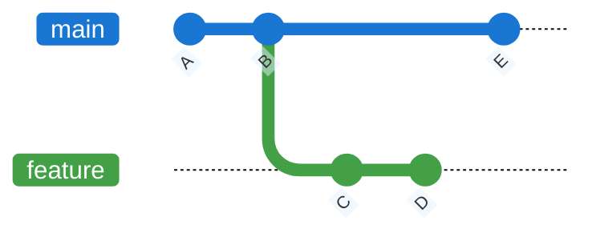
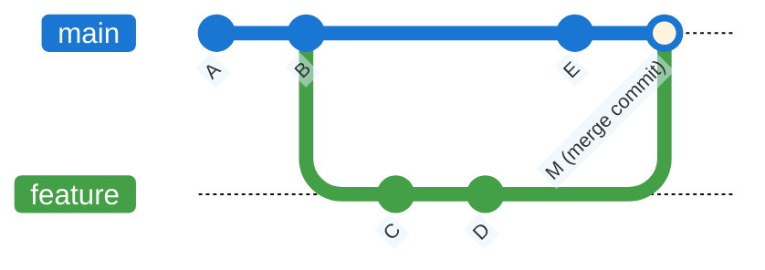
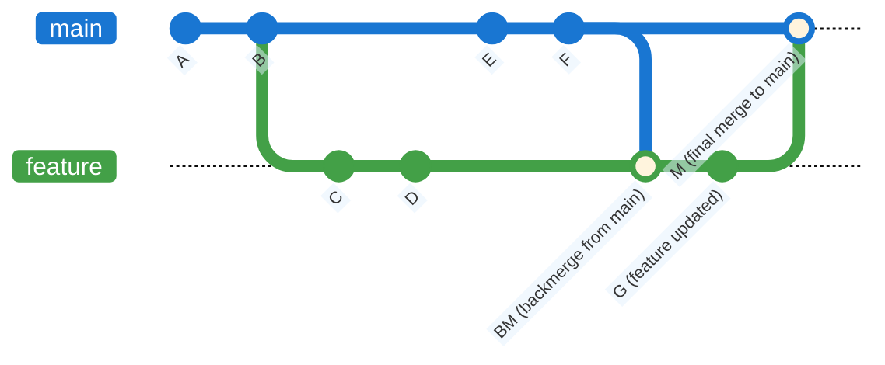
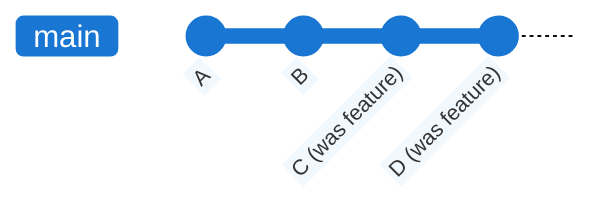
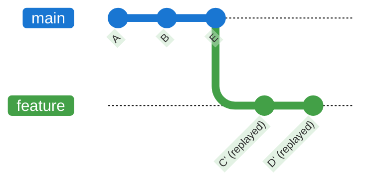
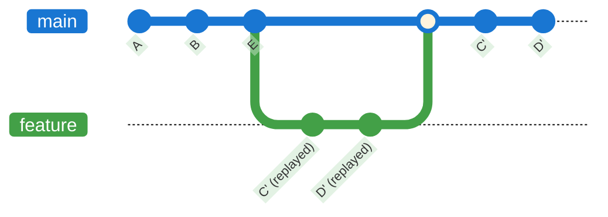
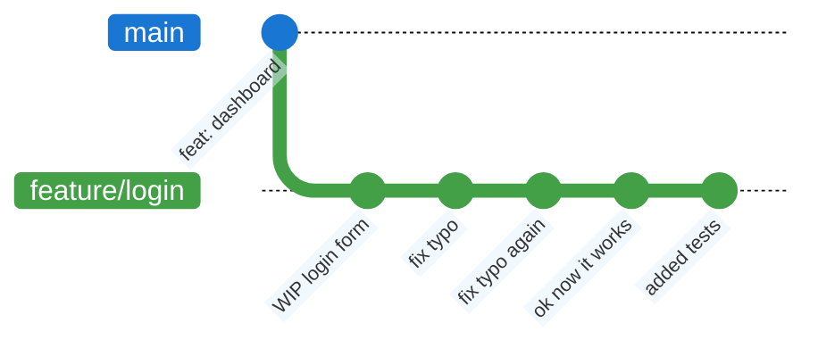
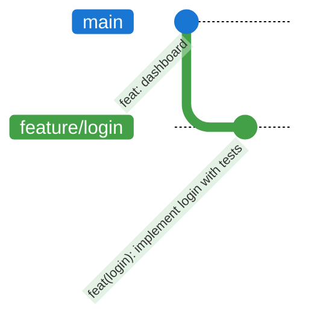
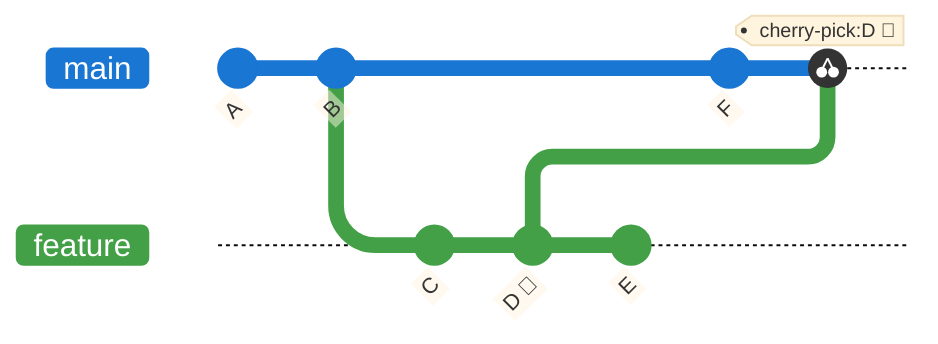
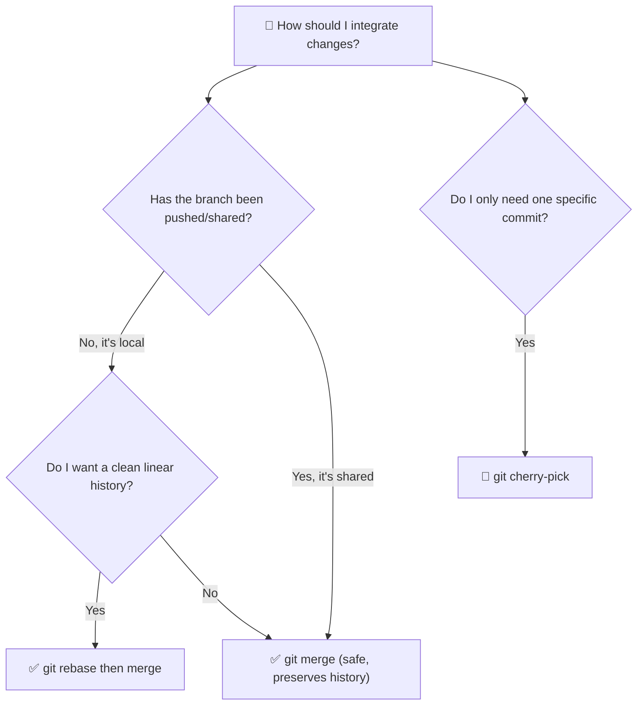

Merge vs Rebase vs Cherry-pick
======================================================================

These are the three main strategies to bring commits from one branch into another. Each has a different impact on **history shape**.

---

### Starting point

Imagine this history: `main` and `feature` have both added commits after a common base.



---

### Strategy 1 — Merge

`git merge` integrates the histories by creating a **merge commit** with two parents. The original commits are preserved exactly as they were. History is **non-linear but complete**.



- ✅ Safe on shared branches — does not rewrite history.
- ✅ You always know exactly when and where integrations happened.
- ⚠️ History can become tangled with many parallel branches.

#### Practical note: backmerge from `main`

In a real project, a common and safe approach is to do a **backmerge from `main` into the feature branch** so your work stays aligned with the latest integrations (bug fixes, refactors, and teammates' commits).



In practice: you work on `feature`, periodically run `git merge main` while on `feature`, and then merge `feature` back into `main` when it is ready.

---

### Fast-forward Merge

If `main` has no new commits since the branch was created, Git can simply **move the pointer** forward — no merge commit needed. This is called a **fast-forward**.



Use `git merge --no-ff feature` to **force a merge commit** even in fast-forward cases. This is a common convention to preserve the "this was a feature branch" evidence in history.

---

### Strategy 2 — Rebase

`git rebase` moves the base of the feature branch to the tip of `main`, **replaying** each commit one by one. The result is a **linear history**, as if the feature was developed after `E`.



> Note: the rebased commits `C'` and `D'` have **new hashes** — they are technically new objects, even if their content is identical.

At this point, you can go back to the main branch and do a fast-forward merge.



- ✅ Clean, linear history — easy to read with `git log`.
- ✅ Great for keeping a feature branch up to date with `main` before merging.
- ⚠️ **Never rebase commits that have already been pushed to a shared branch.** This rewrites hashes and forces others to reconcile the divergence.

**The golden rule of rebase**: only rebase local, private branches.

---

### Squash Commits

**Squash** means collapsing multiple commits into a single, clean commit. This is done via **interactive rebase** (`git rebase -i`) and is used to clean up a messy feature branch before merging.

#### Before squash



#### After squash



#### How interactive rebase works

```bash
git rebase -i HEAD~5   # open interactive editor for last 5 commits
```

Git opens an editor with a list of commits. You change the word `pick` to `squash` (or `s`) for every commit you want to fold into the one above it:

```
pick  a1b2c3d WIP login form
squash b2c3d4e fix typo
squash c3d4e5f fix typo again
squash d4e5f6g ok now it works
squash e5f6g7h added tests
```

After saving, Git opens a second editor to write the **combined commit message**.

> ⚠️ Squash rewrites history. Only squash commits that have **not been pushed** to a shared remote, or use with care and coordinate with your team.

---

### Strategy 3 — Cherry-pick

`git cherry-pick` copies a **single specific commit** (or a range) from any branch and applies it to the current branch. It does not merge anything — it just picks one commit.



- ✅ Surgical: bring only the fix you need without the whole branch.
- ✅ Useful to **backport a hotfix** from `main` to a release branch.
- ⚠️ Creates a duplicate commit with a new hash — can cause confusion if the branch is later fully merged.

```bash
git cherry-pick <commit-hash>            # pick one commit
git cherry-pick A..B                     # pick a range of commits
git cherry-pick --no-commit <hash>       # apply changes without committing (inspect first)
git cherry-pick --abort                  # cancel if a conflict is too complex
```

---

### Decision Guide



---

### Final Takeaway

> **Merge integrates.**  
> **Rebase reshapes.**  
> **Cherry-pick extracts.**
> 
> Each strategy changes the shape of your history.  
> Make the change intentionally.
