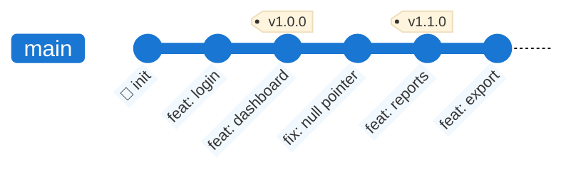
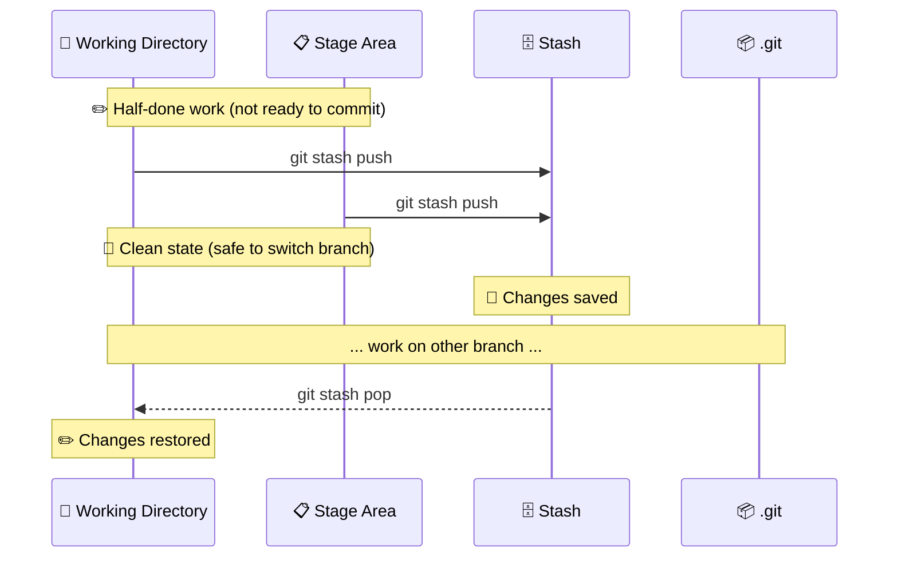
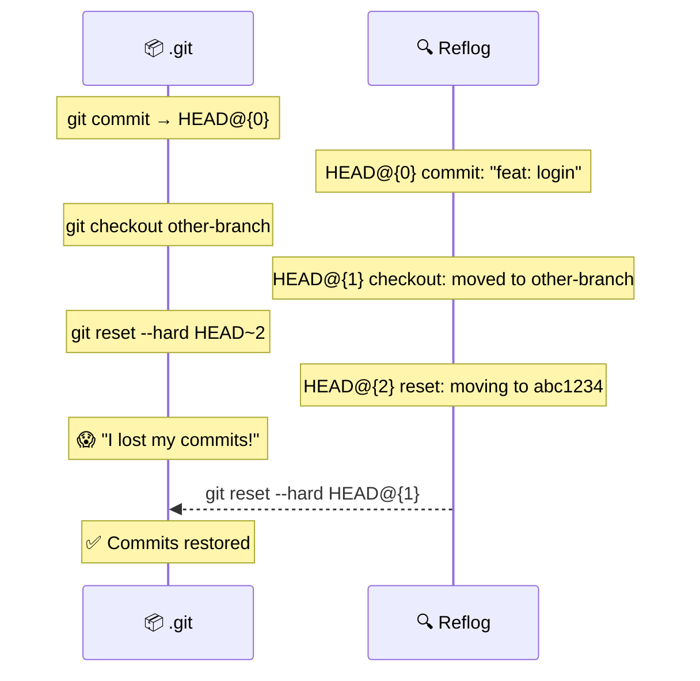

Advanced Git Concepts
======================================================================

This module covers advanced Git techniques used daily in professional workflows:

- 🏷️ **Tags** — mark significant points in history
- 📦 **Stash** — temporarily shelve uncommitted work
- 🔍 **Reflog** — the safety net for lost commits

Tags
======================================================================

A **tag** is a named, immutable pointer to a specific commit. Unlike branches, tags do not move when new commits are added. They are typically used to mark **release versions**.



### Lightweight vs Annotated Tags

| Type            | Command                          | Stored as                                 | Use case            |
| --------------- | -------------------------------- | ----------------------------------------- | ------------------- |
| **Lightweight** | `git tag v1.0.0`                 | A simple pointer to a commit              | Quick local markers |
| **Annotated**   | `git tag -a v1.0.0 -m "message"` | A full Git object (author, date, message) | Official releases ✅ |

Annotated tags are preferred for releases because they carry metadata and can be signed with GPG.

```bash
git tag -a v1.0.0 -m "Release version 1.0.0"   # create annotated tag
git tag                                           # list all tags
git show v1.0.0                                  # inspect the tag
git push origin v1.0.0                           # push a single tag
git push origin --tags                           # push all tags
git tag -d v1.0.0                                # delete local tag
git push origin --delete v1.0.0                 # delete remote tag
```

> ⚠️ Tags are **not pushed automatically** with `git push`. You must push them explicitly.

Stash
======================================================================

`git stash` temporarily shelves changes in the Working Directory and Staging Area so you can switch context without committing half-done work.



```bash
git stash push -m "WIP: half-done feature"   # save with a description
git stash list                                # list all stashes
git stash show stash@{0}                     # inspect the most recent stash
git stash pop                                 # restore and remove from stash list
git stash apply stash@{1}                    # restore without removing from list
git stash drop stash@{0}                     # delete a specific stash
git stash clear                              # delete all stashes
```

> 💡 By default, `git stash` does **not** stash untracked files. Use `git stash push -u` to include them too.

Reflog
======================================================================

`git reflog` is Git's **internal diary** — it records every movement of HEAD, including commits, checkouts, resets, merges and rebases. It is your **safety net** when you think you've lost work.



```bash
git reflog                          # show all HEAD movements
git reflog show feature/login       # show movements of a specific branch
git reset --hard HEAD@{3}           # jump back to a specific reflog entry
git checkout -b recovered HEAD@{2}  # recover lost commits on a new branch
```

> 💡 Reflog entries are kept for **90 days** by default. After that, they are garbage-collected. You cannot recover commits from before that window.

> ⚠️ Reflog is **local only** — it is not pushed to the remote. It is a personal safety net, not a team backup.
