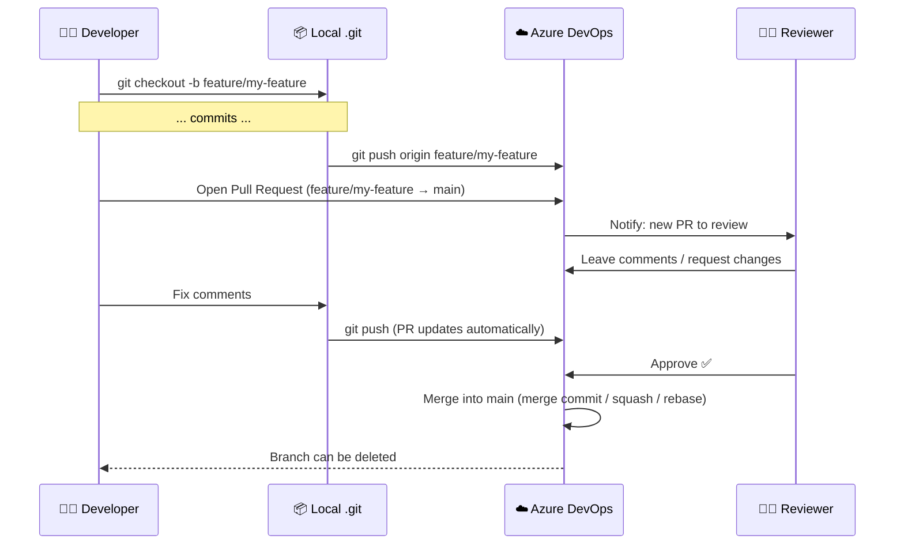
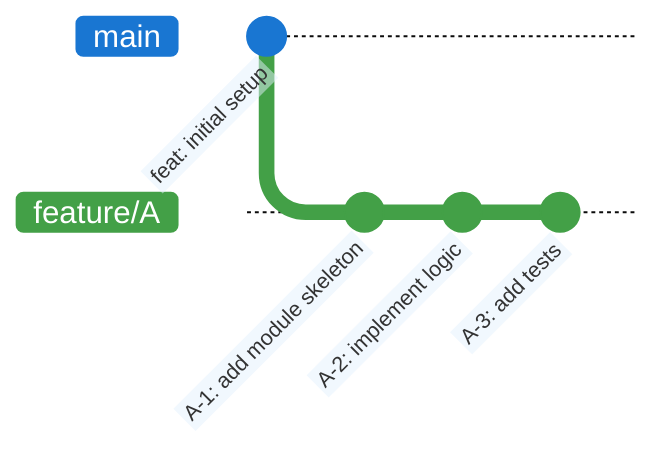
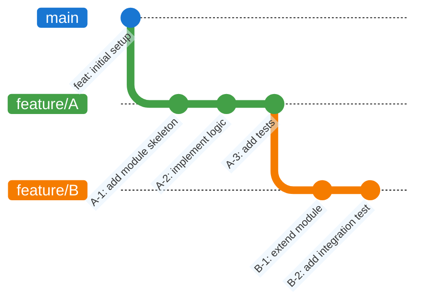
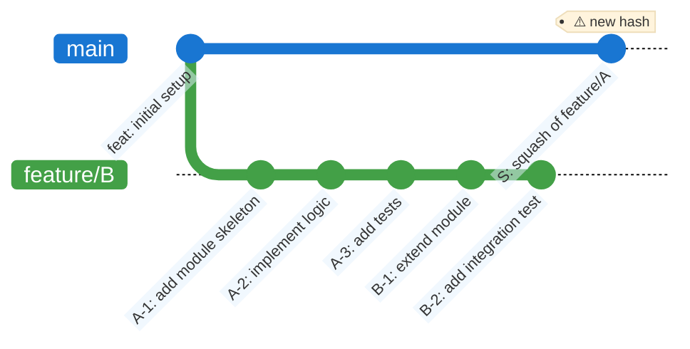
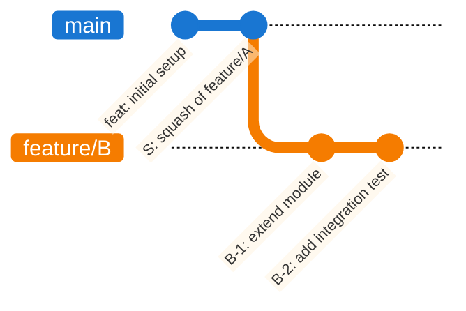
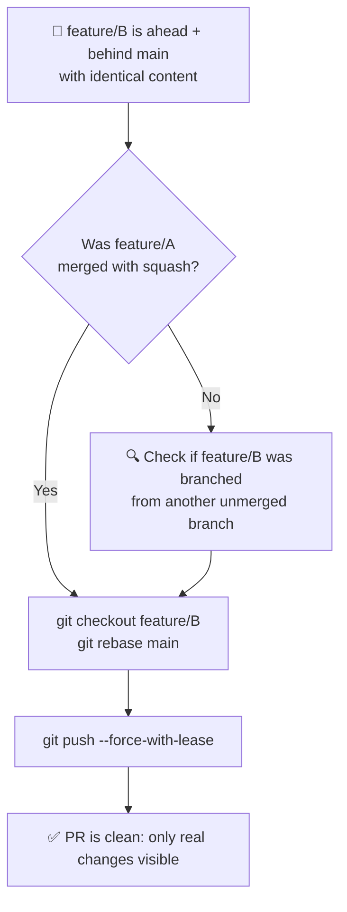

Pull Requests & the Squash Merge Trap
======================================================================

Understand the Pull Request workflow in Azure DevOps, and master a common advanced scenario: diagnosing the "ahead + behind on identical content" problem caused by improper use of squash merges.

> 💡 **Tip**: After every meaningful change, run:
> 
> ```bash
> git status
> git log --oneline --graph --all
> ```

---

## Part 1 — Pull Requests

### What is a Pull Request?

A **Pull Request (PR)** is not a Git concept — it is a feature of hosting platforms (Azure DevOps, GitHub, GitLab). It is a formal request to merge a branch into another, wrapped in a **review and approval workflow**.

The name is slightly misleading: there is no `git pull` involved from the author's side. The platform is asking the team to *review and pull* the changes into the target branch.



---

### The PR Lifecycle in Azure DevOps

#### 1. Push the branch

```bash
git checkout -b feature/my-feature
# ... make commits ...
git push origin feature/my-feature
```

Azure DevOps detects the new branch and shows a **"Create a pull request"** banner on the repository page.

#### 2. Open the PR

In ADO: **Repos → Pull Requests → New Pull Request**


| Field             | Guidance                                                             |
| ----------------- | -------------------------------------------------------------------- |
| **Title**         | Follow Conventional Commits style: `feat(module): short description` |
| **Description**   | Explain *why*, link to the work item, list what was changed          |
| **Target branch** | Usually `main` or `develop`                                          |
| **Reviewers**     | Add at least one — most teams require it for merge                   |
| **Work items**    | Link the ADO task/story to close it automatically on merge           |


#### 3. Review

Reviewers can comment on individual lines, request changes, or approve. The author pushes new commits to address feedback — the PR updates automatically without reopening.


#### 4. Merge strategies in ADO

When completing the PR, ADO offers three strategies:

| Strategy                    | What it does                                 | Local equivalent                     | History shape                              |
| --------------------------- | -------------------------------------------- | ------------------------------------ | ------------------------------------------ |
| **Merge commit**            | Creates a merge commit with two parents      | `git merge --no-ff`                  | Non-linear ✅ evidence of the branch        |
| **Squash commit**           | Collapses all PR commits into one new commit | `git merge --squash && git commit`   | Linear, but ⚠️ new hash                    |
| **Rebase and fast-forward** | Replays commits one by one on top of target  | `git rebase` + `git merge --ff-only` | Linear, original commit messages preserved |

> 💡 **Which one to choose?** Discuss as a team and stick to one convention. Mixing strategies — especially mixing squash with other methods — is the root cause of the problem described in Case 1 below.

#### 5. Branch policies (best practices)

Azure DevOps lets you enforce rules on protected branches (`main`, `develop`, etc):

- **Minimum number of reviewers** — require at least 1 approval before merge
- **Linked work items** — require a task to be linked
- **Build validation** — run CI pipelines automatically on each PR push; block merge if they fail
- **Comment resolution** — block merge until all comments are resolved
- **Delete source branch after merging** — always enable this; see Case 1

> Temporary link https://dev.azure.com/bt-rndorg/BusinessProcessTest/_settings/repositories?repo=3f94c906-b281-4ad8-9ae3-249fb3790a4e&_a=policiesMid&refs=refs/heads/main

---

## Notable Case 1 — The Squash Merge Trap

### The scenario

This is one of the most confusing situations in day-to-day Git usage. Two branches contain **identical file content**, yet Azure DevOps shows one branch as both **N commits ahead** and **M commits behind** the other. Attempting to open a PR results in a diff that shows nothing changed — yet Git insists the branches are different.

The root cause is almost always: **inconsistent use of squash merges**.

### How it happens — step by step

A developer creates `feature/A` from `main` and makes three commits.



Before `feature/A` is merged, a second developer branches `feature/B` from `feature/A` to build on top of its work:



`feature/A` is completed and merged into `main` via a PR — **using the Squash strategy**. Azure DevOps collapses A-1, A-2, and A-3 into a single new commit `S` with a **brand new hash**:



Now the situation is broken. From Git's perspective:

- `main` has commit `S` — which `feature/B` does **not** have → `feature/B` is **behind** main
- `feature/B` has commits `A-1`, `A-2`, `A-3` — which `main` does **not** have → `feature/B` is **ahead** of main

Yet the files are identical. Git compares by **commit hash**, not by file content. `S` and `{A-1, A-2, A-3}` produce the same tree, but they are completely different objects in the graph.

### What you see in Azure DevOps

When you open a PR from `feature/B` to `main`:

```
feature/B is 5 commits ahead, 1 commit behind main
```

The **Files** tab of the PR shows only the diff of B-1 and B-2 (which is the real change). But the **Commits** tab lists A-1, A-2, A-3 as "incoming" commits — which ADO cannot automatically resolve, since their squash equivalent `S` is already on main with a different hash.

If left unresolved, the merge will either fail or introduce a confusing merge commit that re-applies already-present changes.

---

### The fix

The correct procedure is to **rebase `feature/B` onto the current `main`**. This replays B-1 and B-2 on top of `S`, discarding A-1, A-2, A-3 (whose content is already in `S`):

```bash
git checkout feature/B
git rebase main
```



After the rebase, force-push `feature/B`:

```bash
git push origin feature/B --force-with-lease
```

The PR now correctly shows: **2 commits ahead, 0 commits behind**. The Files tab shows only the real changes from B-1 and B-2.

> ⚠️ `--force-with-lease` is safer than `--force`: it aborts the push if someone else has pushed to the same branch in the meantime, preventing you from overwriting their work.


---

### How to prevent it — the two rules

The problem arises from **breaking the chain** between a dependent branch and its parent. Two simple rules prevent it entirely:

**Rule 1 — Be consistent with the merge strategy.** If your team uses squash, use squash for every PR. Mixing squash with merge commits makes history impossible to reason about.

**Rule 2 — Never branch from a feature branch that has not yet been merged.** Always branch from `main` (or your integration branch). If you need work from an unmerged branch, use cherry-pick for specific commits, or wait for the PR to be merged first.

If Rule 2 is violated by necessity (e.g. time pressure), document the dependency in the PR description and rebase `feature/B` onto `main` immediately after `feature/A` is merged.



---