# Version Control System e Git Basics

## Indice
1. [Cos'è un Version Control System](#cosè-un-version-control-system)
2. [Tipi di VCS](#tipi-di-vcs)
3. [Git - I Fondamenti](#git---i-fondamenti)
4. [Le Tre Aree di Git](#le-tre-aree-di-git)
5. [Stati dei File](#stati-dei-file)

---

## Cos'è un Version Control System

Un **Version Control System (VCS)** è un sistema che registra le modifiche a uno o più file nel tempo, permettendo di:

- 📜 **Tracciare la storia** di ogni modifica
- ⏪ **Tornare indietro** a versioni precedenti
- 👥 **Collaborare** con altri sviluppatori
- 🔀 **Gestire versioni parallele** del codice

---

## Tipi di VCS

### VCS Locali
Solo sul tuo computer. Esempio: copiare cartelle con date diverse.

```mermaid
flowchart TD
    subgraph LOCAL["💻 Computer Locale"]
        direction TB
        A["📁 progetto_v1"] 
        B["📁 progetto_v2"]
        C["📁 progetto_finale"]
        D["📁 progetto_finale_2"]
    end
    
    A ~~~ B
    B ~~~ C
    C ~~~ D
    
    style LOCAL fill:#FAFAFA,stroke:#E53935,stroke-width:2px
    style A fill:#FFCDD2,stroke:#C62828,stroke-width:2px,color:#333
    style B fill:#FFCDD2,stroke:#C62828,stroke-width:2px,color:#333
    style C fill:#FFCDD2,stroke:#C62828,stroke-width:2px,color:#333
    style D fill:#FFCDD2,stroke:#C62828,stroke-width:2px,color:#333
```

**Problemi**: Facile perdere traccia, nessuna collaborazione

---

### VCS Centralizzati (CVCS)
Un server centrale contiene tutte le versioni. Esempio: SVN, CVS.

```mermaid
flowchart TD
    subgraph SERVER["🖥️ Server Centrale"]
        S[("📦 Repository")]
    end
    
    subgraph DEVS["👨‍💻 Sviluppatori"]
        A["💻 Dev 1"]
        B["💻 Dev 2"]
        C["💻 Dev 3"]
    end
    
    A --> S
    B --> S
    C --> S
    
    style SERVER fill:#E3F2FD,stroke:#1565C2,stroke-width:2px
    style DEVS fill:#FAFAFA,stroke:#78909C,stroke-width:2px
    style S fill:#1976D2,stroke:#0D47A1,stroke-width:3px,color:#fff
    style A fill:#ECEFF1,stroke:#455A64,stroke-width:2px,color:#333
    style B fill:#ECEFF1,stroke:#455A64,stroke-width:2px,color:#333
    style C fill:#ECEFF1,stroke:#455A64,stroke-width:2px,color:#333
    
    linkStyle default stroke:#1976D2,stroke-width:2px
```

**Problemi**: Single point of failure, dipendenza dalla rete

---

### VCS Distribuiti (DVCS) ✅
Ogni sviluppatore ha una **copia completa** del repository. Esempio: **Git**, Mercurial.

```mermaid
flowchart TD
    subgraph REMOTE["☁️ Remote"]
        R[("🌐 Origin")]
    end
    
    subgraph DEV1["👨‍💻 Dev 1"]
        L1[("📦 Repo Locale")]
    end
    
    subgraph DEV2["👩‍💻 Dev 2"]
        L2[("📦 Repo Locale")]
    end
    
    L1 <-->|push/pull| R
    L2 <-->|push/pull| R
    L1 <-.->|collaborazione| L2
    
    style REMOTE fill:#E8F5E9,stroke:#2E7D32,stroke-width:2px
    style DEV1 fill:#E3F2FD,stroke:#1565C2,stroke-width:2px
    style DEV2 fill:#E3F2FD,stroke:#1565C2,stroke-width:2px
    style R fill:#43A047,stroke:#1B5E20,stroke-width:3px,color:#fff
    style L1 fill:#1976D2,stroke:#0D47A1,stroke-width:2px,color:#fff
    style L2 fill:#1976D2,stroke:#0D47A1,stroke-width:2px,color:#fff
    
    linkStyle 0 stroke:#43A047,stroke-width:3px
    linkStyle 1 stroke:#43A047,stroke-width:3px
    linkStyle 2 stroke:#78909C,stroke-width:2px,stroke-dasharray:5
```

**Vantaggi**: Lavoro offline, backup distribuiti, velocità

---

## Git - I Fondamenti

### Cos'è Git?

Git è un **DVCS** creato da Linus Torvalds nel 2005 per gestire lo sviluppo del kernel Linux.

### Caratteristiche Principali

| Caratteristica | Descrizione |
|----------------|-------------|
| **Distribuito** | Ogni clone è un backup completo |
| **Veloce** | Operazioni locali quasi istantanee |
| **Branching** | Branch leggeri e veloci |
| **Integrità** | Ogni file è verificato con SHA-1 |

---

## Le Tre Aree di Git

Git gestisce i file attraverso **tre aree principali**:

```mermaid
flowchart LR
    subgraph WD_BOX["📂 WORKING DIRECTORY"]
        WD["📝 I tuoi file"]
    end
    
    subgraph SA_BOX["📋 STAGING AREA"]
        SA["✅ Modifiche pronte"]
    end
    
    subgraph REPO_BOX["📦 REPOSITORY"]
        R["📚 Storia commits"]
    end
    
    WD -->|"<b>git add</b>"| SA
    SA -->|"<b>git commit</b>"| R
    R -->|"<b>git checkout</b>"| WD
    
    style WD_BOX fill:#FFF8E1,stroke:#FF8F00,stroke-width:2px
    style SA_BOX fill:#E8F5E9,stroke:#2E7D32,stroke-width:2px
    style REPO_BOX fill:#E3F2FD,stroke:#1565C2,stroke-width:2px
    style WD fill:#FFB300,stroke:#FF6F00,stroke-width:2px,color:#fff
    style SA fill:#43A047,stroke:#1B5E20,stroke-width:2px,color:#fff
    style R fill:#1976D2,stroke:#0D47A1,stroke-width:2px,color:#fff
    
    linkStyle 0 stroke:#43A047,stroke-width:3px
    linkStyle 1 stroke:#1976D2,stroke-width:3px
    linkStyle 2 stroke:#78909C,stroke-width:2px,stroke-dasharray:5
```

### Spiegazione

| Area | Descrizione | Comando |
|------|-------------|---------|
| **Working Directory** | I file su cui stai lavorando | - |
| **Staging Area** | Modifiche selezionate per il prossimo commit | `git add` |
| **Repository** | La storia completa del progetto | `git commit` |

---

## Stati dei File

Un file in Git può trovarsi in diversi stati:

```mermaid
%%{init: {'theme': 'base', 'themeVariables': { 'primaryColor': '#1976D2', 'primaryTextColor': '#fff', 'primaryBorderColor': '#0D47A1', 'lineColor': '#455A64', 'secondaryColor': '#E8F5E9', 'tertiaryColor': '#FFF8E1'}}}%%
stateDiagram-v2
    direction LR
    [*] --> Untracked: 📄 Nuovo file
    Untracked --> Staged: git add
    Staged --> Committed: git commit
    Committed --> Modified: ✏️ Modifica
    Modified --> Staged: git add
    Staged --> Modified: ✏️ Modifica
    Committed --> Untracked: git rm
    
    classDef untracked fill:#FFCDD2,stroke:#C62828,stroke-width:2px,color:#333
    classDef staged fill:#C8E6C9,stroke:#2E7D32,stroke-width:2px,color:#333
    classDef committed fill:#BBDEFB,stroke:#1565C2,stroke-width:2px,color:#333
    classDef modified fill:#FFE0B2,stroke:#EF6C00,stroke-width:2px,color:#333
    
    class Untracked untracked
    class Staged staged
    class Committed committed
    class Modified modified
```

### Descrizione Stati

| Stato | Significato |
|-------|-------------|
| **Untracked** | Git non sta tracciando questo file |
| **Staged** | File pronto per essere committato |
| **Committed** | File salvato nel repository |
| **Modified** | File modificato dopo l'ultimo commit |

---

## Comandi Essenziali - Panoramica

---

## Prossimi Passi

Ora che conosci la teoria, è tempo di praticare!

➡️ Vai alla [prima esercitazione: Basic Commands](../02-esercitazioni/01-basic-commands/guida.md)
