Version Control System
======================================================================
Un **Version Control System (VCS)** è un sistema che registra le modifiche a uno o più file nel tempo, permettendo di:
- 📜 **Tracciare la storia** di ogni modifica
- ⏪ **Tornare indietro** a versioni precedenti
- 👥 **Collaborare** con altri sviluppatori
- 🔀 **Gestire versioni parallele** del codice

Tipi di VCS
----------------------------------------------------------------------
### VCS locali
Approccio iniziale dove le modifiche vengono salvate in una directory locale sul computer dell'utente. È semplice ma rischioso (se il disco si rompe, si perde tutto) e poco adatto alla collaborazione.

:::mermaid
flowchart TD
    subgraph LOCAL["💻 Computer Locale"]
        direction TB
        A["📁 progetto_v1"] 
        B["📁 progetto_v2"]
        C["📁 progetto_finale"]
        D["📁 progetto_finale_vero"]
    end
    
    A --> B
    B --> C
    C --> D
:::

### VCS Centralizzati (CVCS)
Utilizzano un server centrale unico per memorizzare tutti i file e le versioni. Esempio: SVN, CVS. **Problemi**: Single point of failure, dipendenza dalla rete.
:::mermaid
flowchart TD
    subgraph SERVER["🖥️ Server Centrale"]
        S[("📦 Repository")]
    end
    
    subgraph DEVS["👨‍💻 Sviluppatori"]
        A["💻 Dev 1"]
        B["💻 Dev 2"]
        C["💻 Dev 3"]
    end
    
    A --> S
    B --> S
    C --> S
:::

### VCS Distribuiti (DVCS) ✅
Ogni sviluppatore ha una **copia completa** del repository. Esempio: **Git**, Mercurial. **Vantaggi**: Lavoro offline, backup distribuiti, velocità.

:::mermaid
flowchart TD
    subgraph REMOTE["☁️ Remote"]
        R[("🌐 Origin")]
    end
    
    subgraph DEV1["👨‍💻 Dev 1"]
        L1[("📦 Repo Locale")]
    end
    
    subgraph DEV2["👩‍💻 Dev 2"]
        L2[("📦 Repo Locale")]
    end
    
    L1 <-->|push/pull| R
    L2 <-->|push/pull| R
    L1 <-.->|collaborazione| L2
:::

---

Git
======================================================================
Git è un **DVCS** creato da Linus Torvalds nel 2005 per gestire lo sviluppo del kernel Linux.
- Ogni versione di un progetto contiene una copia dei file modificati e, per gli altri, il riferimento alla precedente.
- Ogni versione (o commit) è identificata da un codice hash di quaranta caratteri: di solito si usano i primi otto.
- Ogni commit è salvato nella cartella nascosta **.git**, chiamata repository locale.
- La repo locale non è la cartella di lavoro locale: Git non salva nulla fino a quando le modifiche non vengono committate.
- Si trova a suo agio con file testuali (es. .txt, .py, .json, .tmdl ecc.) ma poco con file binari (es. .docx, .pbix).

::: mermaid
sequenceDiagram
Commit abcd1234 ->> Commit efgh5678: Salvo la nuova versione del file A
Commit efgh5678 -->> Commit abcd1234: Il file B è recuperato dal commit precedente
:::

Le aree di Git
----------------------------------------------------------------------
:::mermaid
sequenceDiagram
    participant working directory
    participant staged
    participant .git
    participant repo remota

    working directory ->> staged: add
    staged ->> .git: commit
    .git ->> repo remota: push
    repo remota -->> .git: fetch
    .git -->> working directory: merge
    repo remota ->> working directory: pull
:::

| Area | Descrizione | Comando |
|------|-------------|---------|
| **Working Directory** | I file su cui stai lavorando | - |
| **Staging Area** | Modifiche selezionate per il prossimo commit | `git add` |
| **.git** | La storia completa del progetto | `git commit` |
| **repo remota** | Repository online | `git push` per pubblicare, `git fetch` + `git merge` o `git pull` per scaricare  |


Stati dei File
----------------------------------------------------------------------
Un file in Git può trovarsi in diversi stati:

```mermaid
stateDiagram-v2
    direction LR
    [*] --> Untracked: 📄 Nuovo file
    Untracked --> Staged: git add
    Staged --> Committed: git commit
    Committed --> Modified: ✏️ Modifica
    Modified --> Staged: git add
    Staged --> Modified: ✏️ Modifica
    Committed --> Untracked: git rm
```



| Stato | Significato | Note |
|-------|-------------| ---- |
| **Untracked** | Git non sta tracciando questo file | Un comando di ripristino di una vecchia versione, quindi, non impatta questi file |
| **Staged** | File pronto per essere committato | Su VS Code il pulsante *Commit* esegue `git add` e `git commit` contemporaneamente |
| **Committed** | File salvato nel repository | Posso recuperare vecchie versioni con `git checkout` (per vederne i contenuti) oppure `git restore` (per sovvrascrivere)
| **Modified** | File modificato dopo l'ultimo commit e non ancora messo in stage | Un comando di ripristino di una vecchia versione può creare conflitti.

### .gitignore
Quando si lavora in un progetto, si può decidere quali file non debbano mai essere soggetti a controllo di versione (untracked).Per farlo è necessario compilare il file `.gitignore`. Esempi:

```bash
*.log # ignora tutti i file con estensione .log
/logs # ignora la cartella logs nella cartella corrente
docs/ # ignora qualsiasi file di qualsiasi cartella chiamata docs
docs/*.txt # ignora qualsiasi file .txt nella cartella docs
docs/**/*.txt # ignora qualsiasi file .txt nella cartella docs e nelle sue sottocartelle
```
---

Installare Git in Windows
======================================================================
[https://git-scm.com/](https://git-scm.com/). Lasciarsi guidare dal wizard di installazione. Una volta installato, aprire da Start il prompt *git bach* e digitare `git config --list --show-origin` per vedere le attuali config. Ci sono tre ambienti:

| Ambiente   | Path del file di config              | Descrizione                        |
| ---------- | ------------------------------------ | ---------------------------------- |
| `--system` | `C:\Program Files\Git\etc\gitconfig` | Config di sistema.                 |
| `--global` | `C:\Users\<NomeUtente>\.gitconfig`   | Config dell'utente.                |
| `--local`  | `<CartellaDelProgetto>\.git\config`  | Config specifiche per il progetto. |

Bisogna configurare almeno quattro cose:

```bash
git config --global user.name "Nome Cognome"
git config --global user.email "Indirizzo email"
git config --global init.defaultBranch main
git config --global pull.rebase "true"
```

Farsi aiutare
===========================================================================
  `git <comando> --help`.


## Comandi Essenziali - Panoramica

```mermaid
flowchart TB
    subgraph SETUP["🚀 SETUP"]
        direction LR
        A["<code>git init</code>"]
        B["<code>git clone</code>"]
    end
    
    subgraph LOCAL["📝 MODIFICHE LOCALI"]
        direction LR
        C["<code>git status</code>"]
        D["<code>git add</code>"]
        E["<code>git commit</code>"]
    end
    
    subgraph BRANCH["🌿 BRANCHING"]
        direction LR
        F["<code>git branch</code>"]
        G["<code>git checkout</code>"]
        H["<code>git merge</code>"]
    end
    
    subgraph REMOTE["🔄 REMOTE"]
        direction LR
        I["<code>git push</code>"]
        J["<code>git pull</code>"]
        K["<code>git fetch</code>"]
    end
```

