Version Control System
======================================================================
A **Version Control System (VCS)** is a system that records changes to one or more files over time. The advantages are as follows:
- 📜 **Track the history** of every change.
- ⏪ **Revert** to previous versions.
- 👥 **Collaborate** with other developers.
- 🔀 **Manage parallel versions** of the code.

Types of VCSs
----------------------------------------------------------------------
### Local Version Control Systems
It involves copying files to a local folder. It's simple but risky and not suitable for collaboration.

:::mermaid
flowchart
    subgraph LOCAL["💻 Local computer"]
        A["📁 project_v1"] 
        B["📁 project_v2"]
        C["📁 project_final"]
        D["📁 project_final_true"]
    end
    
    A --> B
    B --> C
    C --> D
:::

### Centralized Version Control Systems
They use a single central server to store all files and versions. Compared to a local system, it allows collaboration but has risks (single point of failure, network dependency). For many years, it was the standard.

:::mermaid
flowchart TD
    subgraph SERVER["🖥️ Centralized server"]
        S[("📦 Repository")]
    end
    
    subgraph DEVS["👨‍💻 Developers"]
        A["💻 Dev 1"]
        B["💻 Dev 2"]
        C["💻 Dev 3"]
    end
    
    A --> S
    B --> S
    C --> S
:::

### Distributed Version Control Systems (DVCS) ✅
Each developer has a **full copy** of the repository. Example: **Git**. **Advantages**: offline work, distributed backups.

:::mermaid
flowchart TD
    subgraph REMOTE["☁️ Remote"]
        R[("🌐 Origin")]
    end
    
    subgraph DEV1["👨‍💻 Dev 1"]
        L1[("📦 Local Repo")]
    end
    
    subgraph DEV2["👩‍💻 Dev 2"]
        L2[("📦 Local Repo")]
    end
    
    L1 <-->|push/pull| R
    L2 <-->|push/pull| R
    L1 <-.->|collaboration| L2
:::

Git
======================================================================
Git is a **DVCS** created by Linus Torvalds in 2005 to manage Linux kernel development.
- Each version of a project contains a copy of the modified files and, for other files, a reference to the previous one.
- Each version (or *commit*) is identified by a 40-character hash code: usually the first 8 are used.
- Each commit is saved in the hidden **.git** folder, called the local repository.
- The local repo is not the local working directory: Git doesn't save anything until the changes are committed.
- It works well with text files (e.g., .txt, .py, .json, .tmdl, etc.) but not so well with binary files (e.g., .docx, .pbix).

::: mermaid
sequenceDiagram
Commit abcd1234 ->> Commit efgh5678: ➕ Save the new version of file A
Commit efgh5678 -->> Commit abcd1234: 🟰 File B is recovered from the previous commit
:::


Git Areas
----------------------------------------------------------------------
:::mermaid
sequenceDiagram
    participant 📁 Working Directory
    participant 📋 Stage Area
    participant 📦 .git
    participant 🌐 Remote Repo

    📁 Working Directory ->> 📋 Stage Area: add
    📋 Stage Area ->> 📦 .git: commit
    📦 .git ->> 🌐 Remote Repo: push
    🌐 Remote Repo -->> 📦 .git: fetch
    📦 .git -->> 📁 Working Directory: merge
    🌐 Remote Repo ->> 📁 Working Directory: pull
:::

| Area | Descrizione | Comando |
|------|-------------|---------|
| 📁 **Working Directory** | The files you are working on | - |
| 📋 **Staging Area** | Changes selected for next commit | `git add` |
| 📦 **.git** | The complete story of the project | `git commit` |
| 🌐 **Remote Repo** | Online repository | `git push` to publish, `git fetch` + `git merge` (or `git pull`) to download  |


State of Files in Git
----------------------------------------------------------------------
A file in Git can be in several states:

```mermaid
stateDiagram-v2
    direction LR
    [*] --> Untracked: 📄 New file
    Untracked --> Staged: git add
    Staged --> Committed: git commit
    Committed --> Modified: ✏️ Edit
    Modified --> Staged: git add
    Staged --> Modified: ✏️ Edit
    Committed --> Untracked: git rm
```



| Status | Meaning | Notes |
|-------|-------------| ---- |
| **Untracked** | Git isn't tracking this file | Therefore, reverting to an old version doesn't impact these files |
| **Staged** | File ready to be committed | In VS Code, the *Commit* button runs `git add` and `git commit` simultaneously |
| **Committed** | File saved in the repository | I can retrieve old versions with `git checkout` (to see its contents) or `git restore` (to overwrite)
| **Modified** | File modified since the last commit and not yet staged | Reverting to an old version can cause conflicts.

### .gitignore
When working in a project, you can decide which files should never be subject to version control (untracked). To do this, you need to compile the `.gitignore` file. Examples:

```bash
*.log # ignores all files with the .log extension
/logs # ignores the logs folder in the current folder
docs/ # ignores any file in any folder named docs
docs/*.txt # ignores any .txt file in the docs folder
docs/**/*.txt # ignores any .txt file in the docs folder and its subfolders
```
> 👀 Power BI `.gitignore`:

Cache.abf files, being very large binary files, are usually untracked.

Install Git on Windows
======================================================================
[https://git-scm.com/](https://git-scm.com/). Follow the installation wizard. Once installed, open the *git bach* prompt from the Start menu and type `git config --list --show-origin` to view the current configuration. There are three environments:

| Environment | Path of the config file              | Description                        |
| ----------- | ------------------------------------ | ---------------------------------- |
| `--system`  | `C:\Program Files\Git\etc\gitconfig` | Sytem config.                      |
| `--global`  | `C:\Users\<NomeUtente>\.gitconfig`   | User config.                       |
| `--local`   | `<CartellaDelProgetto>\.git\config`  | Project-specific configurations.   |

You need to configure at least four things:

```bash
git config --global user.name "<Name Surname>"
git config --global user.email "<Email>"
git config --global init.defaultBranch main
git config --global pull.rebase "true"
```

Get Help
===========================================================================
  `git <command> --help`.

Basic Commands
===========================================================================

:::mermaid
flowchart
    subgraph SETUP["🚀 SETUP"]
        direction LR
        A["<code>git init</code>"]
        B["<code>git clone</code>"]
    end
    
    subgraph LOCAL["📝 LOCAL CHANGES"]
        direction LR
        C["<code>git status</code>"]
        D["<code>git add</code>"]
        E["<code>git commit</code>"]
    end
    
    subgraph BRANCH["🌿 BRANCHING"]
        direction LR
        F["<code>git branch</code>"]
        G["<code>git checkout</code>"]
        H["<code>git merge</code>"]
    end
    
    subgraph REMOTE["🔄 REMOTE"]
        direction LR
        I["<code>git push</code>"]
        J["<code>git pull</code>"]
        K["<code>git fetch</code>"]
    end
:::