```mermaid
flowchart LR
    subgraph PRIMA[" PRIMA "]
        A["📄 progetto.txt<br/><i>UNTRACKED</i>"]
    end
    
    subgraph DOPO[" DOPO git add "]
        B["✅ progetto.txt<br/><i>STAGED</i>"]
    end
    
    A -->|"<b>git add</b>"| B
    
    style PRIMA fill:#FFEBEE,stroke:#C62828,stroke-width:2px
    style DOPO fill:#E8F5E9,stroke:#2E7D32,stroke-width:2px
    style A fill:#EF5350,stroke:#C62828,stroke-width:2px,color:#fff
    style B fill:#43A047,stroke:#1B5E20,stroke-width:2px,color:#fff
    
    linkStyle 0 stroke:#43A047,stroke-width:3px
```

```mermaid
flowchart LR
    subgraph SA[" STAGING AREA "]
        S["✅ progetto.txt"]
    end
    
    subgraph REPO[" REPOSITORY "]
        R["💾 Commit abc123"]
    end
    
    S -->|"<b>git commit</b>"| R
    
    style SA fill:#E8F5E9,stroke:#2E7D32,stroke-width:2px
    style REPO fill:#E3F2FD,stroke:#1565C2,stroke-width:2px
    style S fill:#43A047,stroke:#1B5E20,stroke-width:2px,color:#fff
    style R fill:#1976D2,stroke:#0D47A1,stroke-width:2px,color:#fff
    
    linkStyle 0 stroke:#1976D2,stroke-width:3px
```

```mermaid
%%{init: {'theme': 'base', 'gitGraph': {'mainBranchName': 'main', 'showCommitLabel': true}, 'themeVariables': { 'git0': '#1976D2', 'git1': '#43A047', 'gitBranchLabel0': '#fff', 'commitLabelColor': '#333', 'commitLabelBackground': '#E3F2FD', 'commitLabelFontSize': '12px'}}}%%
gitGraph
    commit id: "🌱 init" tag: "v0.1"
    commit id: "✨ features v1.0"
```

# Esercitazione 1: Git Basic Commands

## Obiettivo
Imparare i comandi fondamentali di Git: `init`, `status`, `add`, `commit`, `log`.

**Tempo stimato**: 15 minuti

---

## Flusso Esercitazione


---

## Passo 1: Inizializzare un Repository

> ⚠️ Questa repo è già inizializzata, ma in un progetto nuovo useresti:

### TODO: suggerire di usare la cartella repos al percorso .. e fare una cartella li dentro
```bash
# Creare una nuova cartella e inizializzarla
mkdir mio-progetto
cd mio-progetto
git init
```

**Cosa succede?**

```mermaid
flowchart TD
    A["📁 Cartella vuota"] -->|"<b>git init</b>"| B["📦 Repository Git"]
    B --> C["✅ .git/ creata"]
    C --> D["🚀 Pronto!"]
    
    style A fill:#ECEFF1,stroke:#455A64,stroke-width:2px,color:#333
    style B fill:#43A047,stroke:#1B5E20,stroke-width:3px,color:#fff
    style C fill:#81C784,stroke:#388E3C,stroke-width:2px,color:#fff
    style D fill:#1976D2,stroke:#0D47A1,stroke-width:2px,color:#fff
    
    linkStyle 0 stroke:#43A047,stroke-width:3px
    linkStyle 1 stroke:#455A64,stroke-width:2px
    linkStyle 2 stroke:#455A64,stroke-width:2px
```


---

## Passo 2: Controlla lo stato del repository

Dall'interno della cartella mio-progetto:
- Tasto destro + Open Git Bash here
- Usare <git-status> per monitorare lo stato della repository

```bash
git status
```

- Copiare il file `02-esercitazioni/progetto.txt` in `mio-progetto`
- Usare <git-status> per monitorare lo stato della repository

**Output atteso**: Vedrai `progetto.txt` come file non ancora trackato.

---

## Passo 3: Esamina il file progetto.txt

Apri il file `progetto.txt` in questa cartella. Contiene:

```
PROGETTO: Sistema di Gestione Ordini
==========================================
Stato: Versione iniziale
Data creazione: [oggi]

DESCRIZIONE
-----------
Questo file simula un progetto software.
Ogni modifica rappresenta un'evoluzione del progetto.
```

---

## Passo 4: Aggiungi il file alla Staging Area

```bash
git add progetto.txt
git status
```



---

## Passo 5: Crea il primo commit

```bash
git commit -m "feat: aggiunge progetto ordini - versione iniziale"
```



---

## Passo 6: Modifica il file

Apri `progetto.txt` e aggiungi questa sezione alla fine:

```
FUNZIONALITÀ v1.0
-----------------
[ ] Creazione ordine
[ ] Lista ordini
[ ] Dettaglio ordine
```

Salva il file.

---

## Passo 7: Controlla le modifiche

```bash
git status
git diff
```

**`git diff`** mostra le differenze tra il file attuale e l'ultimo commit:

```mermaid
flowchart TD
    A["💾 Ultimo Commit"] --> B["<code>git diff</code>"]
    C["📂 Working Directory"] --> B
    B --> D["📊 Mostra differenze"]
    
    style A fill:#1976D2,stroke:#0D47A1,stroke-width:2px,color:#fff
    style C fill:#FFB300,stroke:#FF6F00,stroke-width:2px,color:#fff
    style B fill:#8E24AA,stroke:#4A148C,stroke-width:2px,color:#fff
    style D fill:#F57C00,stroke:#E65100,stroke-width:2px,color:#fff
    
    linkStyle default stroke:#455A64,stroke-width:2px
```



---

## Passo 8: Commit delle modifiche

```bash
git add progetto.txt
git commit -m "feat: aggiunge lista funzionalità v1.0"
```

---

## Passo 9: Visualizza la storia

```bash
git log
git log --oneline
```

**Output atteso**:
```
a1b2c3d (HEAD -> main) feat: aggiunge lista funzionalità v1.0
x9y8z7w feat: aggiunge progetto ordini - versione iniziale
```



---

## Passo 10: Altra modifica + nuovo file

Modifica `progetto.txt`, segna come completata la prima funzionalità:

```
FUNZIONALITÀ v1.0
-----------------
[x] Creazione ordine    <- COMPLETATO!
[ ] Lista ordini
[ ] Dettaglio ordine
```

Aggiungi un file vuoto `note.txt`

Commit:
```bash
git add *
git commit -m "feat: implementa creazione ordine e aggiunta file con note"
```

---

## Riepilogo Comandi

| Comando | Descrizione |
|---------|-------------|
| `git init` | Inizializza un repository |
| `git status` | Mostra lo stato dei file |
| `git add <file>` | Aggiunge file alla staging area |
| `git commit -m "msg"` | Crea un commit |
| `git log` | Mostra la storia dei commit |
| `git diff` | Mostra le differenze |

---

## TODO Spostarsi tra un commit e l'altro e parlare di HEAD

## Esercizio Extra (Opzionale)

1. Aggiungi un nuovo file `note.txt` con alcune note
2. Fai un commit
3. Modifica entrambi i file
4. **Committa solo uno dei due**
5. Verifica con `git status` cosa succede

---

## Prossimo Passo

➡️ Vai alla [esercitazione sui Branch](../02-branches/guida.md)
