```mermaid
%%{init: {'theme': 'base', 'gitGraph': {'mainBranchName': 'main', 'showCommitLabel': true}, 'themeVariables': { 'git0': '#1976D2', 'git1': '#43A047', 'gitBranchLabel0': '#fff', 'gitBranchLabel1': '#fff', 'commitLabelColor': '#333', 'commitLabelBackground': '#E3F2FD'}}}%%
gitGraph
    commit id: "🌱 init"
    branch feature/login
    commit id: "🔐 login impl"
    commit id: "📝 docs"
```

# Esercitazione 2: Git Branches

## Obiettivo
Imparare a creare, navigare e unire branch: `branch`, `checkout`, `switch`, `merge`.

**Tempo stimato**: 15 minuti

---

## Cos'è un Branch?

Un **branch** è una linea di sviluppo indipendente. Permette di:
- Lavorare su feature senza toccare il codice principale
- Sperimentare senza rischi
- Collaborare su diverse funzionalità in parallelo

```mermaid
%%{init: {'theme': 'base', 'gitGraph': {'mainBranchName': 'main', 'showCommitLabel': true}, 'themeVariables': { 'git0': '#1976D2', 'git1': '#43A047', 'git2': '#F57C00', 'gitBranchLabel0': '#fff', 'gitBranchLabel1': '#fff', 'commitLabelColor': '#333', 'commitLabelBackground': '#E3F2FD', 'commitLabelFontSize': '11px'}}}%%
gitGraph
    commit id: "🌱 init"
    commit id: "📦 v1.0"
    branch feature-login
    commit id: "🔐 login-1"
    commit id: "✅ login-2"
    checkout main
    commit id: "🛠️ hotfix"
    merge feature-login
    commit id: "🚀 release"
```



---

## Flusso Esercitazione


---

## Passo 1: Controlla il branch attuale

```bash
cd 02-esercitazioni/02-branches
git branch
```

**Output atteso**: 
```
* main
```

L'asterisco indica il branch corrente.

---
## Passo 3: Crea un nuovo branch

```bash
git checkout -b feature/login
# oppure (Git 2.23+)
git switch -c feature/login
```



```mermaid
%%{init: {'theme': 'base', 'gitGraph': {'mainBranchName': 'main', 'showCommitLabel': true}, 'themeVariables': { 'git0': '#1976D2', 'git1': '#43A047', 'gitBranchLabel0': '#fff', 'gitBranchLabel1': '#fff', 'commitLabelColor': '#333', 'commitLabelBackground': '#C8E6C9', 'commitLabelFontSize': '11px'}}}%%
gitGraph
    commit id: "main-1"
    commit id: "main-2"
    branch feature/login
    commit id: "⭐ QUI SEI TU" type: HIGHLIGHT
```

Aggiungi il file `feature.txt` alla repository.

```bash
git log --oneline --all
```
HEAD si è spostato nel nuovo branch creato.

---

## Passo 4: Modifica il file nel nuovo branch

Modifica `feature.txt`:

```
APP: Sistema di Autenticazione
==============================
Branch: feature/login       <- MODIFICATO!
Versione: 1.1.0-dev         <- MODIFICATO!

MODULI ATTIVI
-------------
[x] Configurazione base
[x] Login utente            <- COMPLETATO!
[ ] Registrazione
[ ] Reset password

DETTAGLI LOGIN (nuovo!)
-----------------------
- Form username/password
- Validazione input
- Sessione utente
```

Commit:
```bash
git add feature.txt
git commit -m "feat(login): implementa modulo login"
```

---
## TODO Fare una modifica sola
## Passo 5: Fai un'altra modifica

Aggiungi ancora al file:

```
LOG SVILUPPO
------------
[2026-02-10] Aggiunto form login
[2026-02-10] Aggiunta validazione
```

Commit:
```bash
git add feature.txt
git commit -m "docs: aggiunge log sviluppo"
```

---

## Passo 6: Visualizza i branch

```bash
git branch -v
git log --graph --all
```



---

## Passo 7: Torna al branch main

```bash
git checkout main
# oppure
git switch main
```

**Cosa noti?** Il file `feature.txt` è tornato alla versione originale!

```mermaid
flowchart LR
    subgraph FEATURE[" 🌿 feature/login "]
        F["📄 feature.txt<br/><b>v1.1</b>"]
    end
    
    subgraph MAIN[" 🔵 main "]
        M["📄 feature.txt<br/><b>v1.0</b>"]
    end
    
    F -.->|"<code>checkout main</code>"| M
    
    style FEATURE fill:#E8F5E9,stroke:#2E7D32,stroke-width:2px
    style MAIN fill:#E3F2FD,stroke:#1565C2,stroke-width:2px
    style F fill:#43A047,stroke:#1B5E20,stroke-width:2px,color:#fff
    style M fill:#1976D2,stroke:#0D47A1,stroke-width:2px,color:#fff
    
    linkStyle 0 stroke:#78909C,stroke-width:2px,stroke-dasharray:5
```



---

## Passo 8: Merge del branch

Unisci le modifiche di `feature/login` in `main`:

```bash
git merge feature/login
```



```mermaid
%%{init: {'theme': 'base', 'gitGraph': {'mainBranchName': 'main', 'showCommitLabel': true}, 'themeVariables': { 'git0': '#1976D2', 'git1': '#43A047', 'gitBranchLabel0': '#fff', 'gitBranchLabel1': '#fff', 'commitLabelColor': '#333', 'commitLabelBackground': '#E3F2FD', 'commitLabelFontSize': '11px'}}}%%
gitGraph
    commit id: "🌱 init"
    branch feature/login
    commit id: "🔐 login"
    commit id: "📝 docs"
    checkout main
    merge feature/login id: "🔀 MERGE" type: HIGHLIGHT
```

**Risultato**: Le modifiche sono ora in `main`!

---

## Passo 9: Verifica il merge

```bash
git log --oneline --graph
cat feature.txt
```

Il file ora contiene tutte le modifiche fatte nel branch `feature/login`.

---

## Passo 10: Elimina il branch (opzionale)

Dopo il merge, puoi eliminare il branch:

```bash
git branch -d feature/login
```

---
## todo Non li gestiamo qui
## Gestione Conflitti (Bonus)

Cosa succede se due branch modificano la stessa riga?

```mermaid
%%{init: {'theme': 'base', 'gitGraph': {'mainBranchName': 'main', 'showCommitLabel': true}, 'themeVariables': { 'git0': '#1976D2', 'git1': '#43A047', 'git2': '#F57C00', 'gitBranchLabel0': '#fff', 'gitBranchLabel1': '#fff', 'commitLabelColor': '#333', 'commitLabelBackground': '#FFCDD2', 'commitLabelFontSize': '11px'}}}%%
gitGraph
    commit id: "🌱 init"
    branch feature-a
    commit id: "modifica riga 5"
    checkout main
    branch feature-b
    commit id: "altra modifica riga 5"
    checkout main
    merge feature-a
    merge feature-b id: "⚠️ CONFLITTO!" type: REVERSE
```



Git ti chiederà di risolvere manualmente il conflitto!

---

## Riepilogo Comandi

| Comando | Descrizione |
|---------|-------------|
| `git branch` | Lista branch |
| `git branch <nome>` | Crea branch |
| `git checkout <branch>` | Cambia branch |
| `git switch <branch>` | Cambia branch (nuovo) |
| `git checkout -b <nome>` | Crea e cambia branch |
| `git merge <branch>` | Unisce branch |
| `git branch -d <nome>` | Elimina branch |

---

## Prossimo Passo

➡️ Vai alla [esercitazione sulle Remote Operations](../03-remote-operations/guida.md)
