# Exercise 2: Git Branches

## Goal
Learn to create, navigate, and merge branches: `branch`, `checkout`, `switch`, `merge`.

> 💡 **Tip**: After every meaningful change, run:
> ```bash
> git status
> git log --oneline --graph --all
> ```

---

## What is a Branch?

A **branch** is an independent line of development. It lets you:
- Work on features without touching the main codebase
- Experiment without risk
- Collaborate on different features in parallel

```mermaid
%%{init: {'theme': 'base', 'gitGraph': {'mainBranchName': 'main', 'showCommitLabel': true}, 'themeVariables': { 'git0': '#1976D2', 'git1': '#43A047', 'git2': '#F57C00', 'gitBranchLabel0': '#fff', 'gitBranchLabel1': '#fff', 'commitLabelColor': '#333', 'commitLabelBackground': '#E3F2FD', 'commitLabelFontSize': '11px'}}}%%
gitGraph
    commit id: "🌱 init"
    commit id: "📦 v1.0"
    branch feature-login
    commit id: "🔐 login-1"
    commit id: "✅ login-2"
    checkout main
    commit id: "🛠️ hotfix"
    merge feature-login
    commit id: "🚀 release"
```



---

## Exercise Flow

:::mermaid
flowchart LR
    A["<b>1</b><br/>Check branch"] --> B["<b>2</b><br/>Create branch"]
    B --> C["<b>3</b><br/>Modify & Commit"]
    C --> D["<b>4</b><br/>Switch to main"]
    D --> E["<b>5</b><br/>Merge"]
    E --> F["<b>6</b><br/>Cleanup"]

    style A fill:#1976D2,stroke:#0D47A1,stroke-width:2px,color:#fff
    style B fill:#43A047,stroke:#1B5E20,stroke-width:2px,color:#fff
    style C fill:#F57C00,stroke:#E65100,stroke-width:2px,color:#fff
    style D fill:#8E24AA,stroke:#4A148C,stroke-width:2px,color:#fff
    style E fill:#1565C2,stroke:#0D47A1,stroke-width:2px,color:#fff
    style F fill:#FFB300,stroke:#FF6F00,stroke-width:2px,color:#fff

    linkStyle default stroke:#455A64,stroke-width:2px
:::

---

## Step 1: Check the Current Branch

From your `my-project` folder (created in Exercise 1):

```bash
git branch
```

**Expected output**: 
```
* main
```

The asterisk marks the current branch.

```bash
git log --oneline --graph --all
```

You should see the commits from Exercise 1. HEAD points to `main`.

---

## Step 2: Create a New Branch

```bash
git checkout -b feature/login
# or (Git 2.23+)
git switch -c feature/login
```



```mermaid
%%{init: {'theme': 'base', 'gitGraph': {'mainBranchName': 'main', 'showCommitLabel': true}, 'themeVariables': { 'git0': '#1976D2', 'git1': '#43A047', 'gitBranchLabel0': '#fff', 'gitBranchLabel1': '#fff', 'commitLabelColor': '#333', 'commitLabelBackground': '#C8E6C9', 'commitLabelFontSize': '11px'}}}%%
gitGraph
    commit id: "main-1"
    commit id: "main-2"
    branch feature/login
    commit id: "⭐ YOU ARE HERE" type: HIGHLIGHT
```

Copy the file `feature.txt` (from `02-esercitazioni/02-branches/`) into your project folder.

```bash
git status
git log --oneline --graph --all
```

Notice: HEAD has moved to the new branch. The file is **untracked** in the Working Directory:

:::mermaid
sequenceDiagram
    participant WD as 📁 Working Directory
    participant SA as 📋 Stage Area
    participant GIT as 📦 .git

    Note over WD: 📄 feature.txt → UNTRACKED
    Note over GIT: HEAD → feature/login
:::

---

## Step 3: Modify, Stage and Commit

Edit `feature.txt` to update it:

```
APP: Authentication System
==============================
Branch: feature/login       <- CHANGED!
Version: 1.1.0-dev          <- CHANGED!

ACTIVE MODULES
-------------
[x] Base configuration
[x] User login              <- DONE!
[ ] Registration
[ ] Password reset

LOGIN DETAILS (new!)
-----------------------
- Username/password form
- Input validation
- User session

DEVELOPMENT LOG
------------
[2026-02-13] Added login form
[2026-02-13] Added validation
```

Stage and commit:

```bash
git add feature.txt
git commit -m "feat(login): implement login module with dev log"
git status
git log --oneline --graph --all
```

The file moved through the areas on the `feature/login` branch:

:::mermaid
sequenceDiagram
    participant WD as 📁 Working Directory
    participant SA as 📋 Stage Area
    participant GIT as 📦 .git

    Note over WD: 📄 UNTRACKED → ✏️ MODIFIED
    WD ->> SA: git add
    Note over SA: ✅ STAGED
    SA ->> GIT: git commit
    Note over GIT: 💾 COMMITTED on feature/login
:::

---

## Step 4: Switch Back to Main

```bash
git checkout main
# or
git switch main
```

**What do you notice?** Open `feature.txt` — the file is back to its original version! Your changes exist only on `feature/login`.

```bash
git log --oneline --graph --all
```



```mermaid
flowchart LR
    subgraph FEATURE[" 🌿 feature/login "]
        F["📄 feature.txt<br/><b>v1.1</b>"]
    end
    
    subgraph MAIN[" 🔵 main "]
        M["📄 feature.txt<br/><b>v1.0</b>"]
    end
    
    F -.->|"<code>checkout main</code>"| M
    
    style FEATURE fill:#E8F5E9,stroke:#2E7D32,stroke-width:2px
    style MAIN fill:#E3F2FD,stroke:#1565C2,stroke-width:2px
    style F fill:#43A047,stroke:#1B5E20,stroke-width:2px,color:#fff
    style M fill:#1976D2,stroke:#0D47A1,stroke-width:2px,color:#fff
    
    linkStyle 0 stroke:#78909C,stroke-width:2px,stroke-dasharray:5
```

> 💡 This is the power of branches: isolated changes. Each branch has its own version of the files.

---

## Step 5: Merge the Branch

Merge the changes from `feature/login` into `main`:

```bash
git merge feature/login
```



```mermaid
%%{init: {'theme': 'base', 'gitGraph': {'mainBranchName': 'main', 'showCommitLabel': true}, 'themeVariables': { 'git0': '#1976D2', 'git1': '#43A047', 'gitBranchLabel0': '#fff', 'gitBranchLabel1': '#fff', 'commitLabelColor': '#333', 'commitLabelBackground': '#E3F2FD', 'commitLabelFontSize': '11px'}}}%%
gitGraph
    commit id: "🌱 init"
    branch feature/login
    commit id: "🔐 login"
    checkout main
    merge feature/login id: "🔀 MERGE" type: HIGHLIGHT
```

Verify the result:

```bash
git log --oneline --graph --all
cat feature.txt
```

The file now contains all the changes made on the `feature/login` branch. **The merge brought them into `main`.**

---

## Step 6: Cleanup

After a successful merge, you can delete the branch:

```bash
git branch -d feature/login
git log --oneline --graph --all
```

The commits remain in the history — only the branch label is removed.

---

## Command Summary

| Command | Description |
|---------|-------------|
| `git branch` | List branches |
| `git branch <name>` | Create a branch |
| `git checkout <branch>` | Switch to a branch |
| `git switch <branch>` | Switch to a branch (modern) |
| `git checkout -b <name>` | Create and switch to a branch |
| `git merge <branch>` | Merge a branch into current |
| `git branch -d <name>` | Delete a branch |

---

## Next Step

➡️ Go to the [Remote Operations exercise](../03-remote-operations/guida.md)
