# Esercitazione 3: Remote Operations

## Obiettivo
Imparare a lavorare con repository remoti: `remote`, `push`, `pull`, `fetch`, `clone`.

**Tempo stimato**: 15 minuti

---

## Differenza tra Fetch, Pull e Push

```mermaid
flowchart LR
    subgraph COMMANDS[" ⚙️ COMANDI REMOTE "]
        direction TB
        A["<code>git fetch</code>"] --> B["👁️ Scarica modifiche<br/><b>NON le applica</b>"]
        C["<code>git pull</code>"] --> D["⬇️ Scarica <b>E</b> applica<br/>modifiche"]
        E["<code>git push</code>"] --> F["⬆️ Invia le tue<br/>modifiche"]
    end
```

| Comando | Cosa fa | Quando usarlo |
|---------|---------|---------------|
| `fetch` | Scarica le modifiche remote senza applicarle | Per vedere cosa c'è di nuovo |
| `pull` | Scarica E applica le modifiche | Per aggiornare il tuo branch |
| `push` | Invia i tuoi commit al remote | Per condividere il tuo lavoro |

---

## Flusso Esercitazione

### 01 Clonare il repository online

1. Aprire Azure DevOps Repos, selezionare il repo e cliccare su Clone.

2. Se si vuole usare Visual Studio Cose cliccare su "Clone in VS Code", altrimenti copiare il path.
3. Aprire una cartella nel proprio pc (si consiglia `<User>/source/repos`), aprire Git Bash e fare `git clone <url>`.
4. Verrà chiesto di autenticarsi ad Azure Entra ID.
5. Una volta fatto, ci dovrebbe essere una nuova cartella con dentro il contenuto clonato.

#### Cosa fare quando l'autenticazione di Entra ID non è supportata

1. E' possibile creare un token di accesso in fase di clonazione.
2. Su Azure DevOps, generare delle Git Credentials e copiarsele.
3. L'url del clone da usare non è più `https://beantech@dev.azure.com/etcetc`
4. Ma diventa `git clone https://<user>:<token>@dev.azure.com/etcetc`

#### Che licenza serve per usare Azure DevOps Repos
1. Licenza Azure DevOps Basic Plan (circa 6€/mese)
1. Licenza Visual Studio

#### Security dei repository Azure DevOps
La gestione della security permette di gestire i permessi delle persone.
https://learn.microsoft.com/en-us/azure/devops/repos/git/set-git-repository-permissions?view=azure-devops

### 02 Aggiungere un file e comparare il repo locale con quello online
1. Aggiungere un file qualsiasi all'interno della cartella clonata
2. `git add .` e `git commit -m "Aggiunto file"`
3. Eseguire `git log` e notare che il repo locale è più avanti rispetto al repo remoto

### 03 Pubblicare
1. Fare `git push` per caricare online il lavoro fatto
2. Eseguire `git log` per notare che, ora, repo locale e repo remoto sono allineati

#### Policy dei repository Azure DevOps
La gestione delle policy permette di gestire le regole di uso dei branch (es. "non è possibile fare push su main").
https://learn.microsoft.com/en-us/azure/devops/repos/git/repository-settings?view=azure-devops&tabs=browser

### 04 Scaricare
1. Per prima cosa simuliamo un collega che pubblica un altro lavoro parallelamente al nostro.
2. Andare su Azure DevOps Repos, premere sui tre puntini a destra e fare "Upload File". Verrà chiesto di fare un commit nuovo direttamente online.
3. Andare ora sul proprio repo locale e fare `git fetch` e `git log`: si dovrebbe notare che il repo online è più avanti rispetto a quello locale.
4. Fare ora `git pull` per applicare effettivamente le modifiche (notarlo facendo nuovamente `git log`).

---

## Riassunto e altri comandi
Un progetto locale può essere collegato a uno **o più** repository remoti (es. Azure DevOps Repos). Un remoto è semplicemente una cartella *.git* diversa da quella locale.

| Comando | Descrizione |
| ------- | ----------- |
| `git clone <url>` | Clonare un repo online. Url `https://beantech@dev.azure.com/etc` oppure `https://<user>:<token>@dev.azure.com/etc.` |
| `git remote add <remotename> <url>` | Collegarsi la prima volta ad un progetto, a partire da un repo locale già esistente. Solitamente si usa `origin` come nome (**non è una regola**, è una convenzione). Nota: è possibile essere collegati a più remote contemporaneamente. |
| `git fetch <remotename>`            | Scaricare i commit di un remote. Scaricarli **non** significa applicarli ai propri branch locali.                          |
| `git pull <remotenane> <branch>`    | Applicare, ad un branch locale, le modifiche appena scaricate. `pull` senza fare prima `fetch` è inutile.                  |
| `git push <remotename> <branch>`    | Pubblica sul remote i nuovi commit del branch locale.                                                                      |
| `git remote remove <remotename>`    | Rimuovi un remote.                                                                                                         |
| `git remote -v`                     | Listare tutti i remote.                                                                                                    |
| `git remote show <remotename>`      | Guardare lo stato di un remote.                                                                                            |

> 📌 Si consiglia di fare `fetch` e `pull` **ogni volta** che si inizia a fare un nuovo lavoro oppure quando si è in procinto di caricare commit online, in modo da essere **sempre allineati** con l'ultima versione pubblicata.