```mermaid
flowchart TD
    A["<code>git fetch</code>"] --> B["⬇️ Scarica in origin/main"]
    B --> C{{"🤔 Vuoi applicare?"}}
    C -->|"Sì"| D["<code>git merge origin/main</code>"]
    C -->|"<code>git pull</code>"| D
    
    style A fill:#8E24AA,stroke:#4A148C,stroke-width:2px,color:#fff
    style B fill:#E1BEE7,stroke:#7B1FA2,stroke-width:2px,color:#333
    style C fill:#FFF8E1,stroke:#FF8F00,stroke-width:2px,color:#333
    style D fill:#1976D2,stroke:#0D47A1,stroke-width:2px,color:#fff
    
    linkStyle default stroke:#455A64,stroke-width:2px
```

# Esercitazione 3: Remote Operations

## Obiettivo
Imparare a lavorare con repository remoti: `remote`, `push`, `pull`, `fetch`, `clone`.

**Tempo stimato**: 15 minuti

---

## Differenza tra Fetch, Pull e Push

```mermaid
flowchart LR
    subgraph COMMANDS[" ⚙️ COMANDI REMOTE "]
        direction TB
        A["<code>git fetch</code>"] --> B["👁️ Scarica modifiche<br/><b>NON le applica</b>"]
        C["<code>git pull</code>"] --> D["⬇️ Scarica <b>E</b> applica<br/>modifiche"]
        E["<code>git push</code>"] --> F["⬆️ Invia le tue<br/>modifiche"]
    end
```



| Comando | Cosa fa | Quando usarlo |
|---------|---------|---------------|
| `fetch` | Scarica le modifiche remote senza applicarle | Per vedere cosa c'è di nuovo |
| `pull` | Scarica E applica le modifiche | Per aggiornare il tuo branch |
| `push` | Invia i tuoi commit al remote | Per condividere il tuo lavoro |

---

## Flusso Esercitazione

## TODO Prima va scaricata, prima si spiega il clone


---

## Passo 1: Verifica il remote configurato

```bash
cd 02-esercitazioni/03-remote-operations
git remote -v
```

**Output atteso** (se c'è un remote):
```
origin  https://github.com/user/repo.git (fetch)
origin  https://github.com/user/repo.git (push)
```

---

## Passo 2: Esamina il file collaborazione.txt

```
PROGETTO: Documentazione Condivisa
==================================
Repository: GitCourse
Branch: main

COLLABORATORI
-------------
- Tu (locale)
- Team (remoto)

STATO SYNC
----------
Ultimo push: [mai]
Ultimo pull: [mai]
```

---

## Passo 3: Modifica locale

Modifica `collaborazione.txt`:

```
PROGETTO: Documentazione Condivisa
==================================
Repository: GitCourse
Branch: main

COLLABORATORI
-------------
- Tu (locale)
- Team (remoto)

STATO SYNC
----------
Ultimo push: [oggi - in attesa]
Ultimo pull: [mai]

MODIFICHE LOCALI
----------------
[2026-02-10] Aggiunta sezione modifiche
```

Commit:
```bash
git add collaborazione.txt
git commit -m "docs: aggiunge sezione modifiche locali"
```

---

## Passo 4: Visualizza commit da pushare

```bash
git log origin/main..HEAD --oneline
```

Questo mostra i commit locali non ancora pushati.

```mermaid
%%{init: {'theme': 'base', 'gitGraph': {'mainBranchName': 'main', 'showCommitLabel': true}, 'themeVariables': { 'git0': '#1976D2', 'git1': '#43A047', 'gitBranchLabel0': '#fff', 'commitLabelColor': '#333', 'commitLabelBackground': '#C8E6C9', 'commitLabelFontSize': '11px'}}}%%
gitGraph
    commit id: "🌐 origin/main"
    commit id: "⭐ local-1" type: HIGHLIGHT
    commit id: "⭐ local-2" type: HIGHLIGHT
```



---

## Passo 5: Push delle modifiche

```bash
git push origin main
# oppure semplicemente
git push
```



```mermaid
%%{init: {'theme': 'base', 'sequence': {'actorFontWeight': 'bold', 'noteFontSize': '12px'}, 'themeVariables': { 'actorBkg': '#1976D2', 'actorTextColor': '#fff', 'actorBorder': '#0D47A1', 'signalColor': '#455A64', 'noteBkgColor': '#E8F5E9', 'noteBorderColor': '#43A047'}}}%%
sequenceDiagram
    participant L as 💻 Locale
    participant R as ☁️ Remote
    
    L->>R: git push ↑
    R-->>L: ✅ Modifiche ricevute
    Note over R: origin/main aggiornato
```

> ⚠️ Se non hai un remote configurato, il push fallirà. Questo è normale per l'esercitazione!

---

## Passo 6: Simulare modifiche remote

In un lavoro reale, altri sviluppatori fanno push. Simuliamo questo scenario:

**Scenario**: Un collega ha modificato lo stesso file sul remote.

```mermaid
%%{init: {'theme': 'base', 'sequence': {'actorFontWeight': 'bold', 'noteFontSize': '11px'}, 'themeVariables': { 'actorBkg': '#1976D2', 'actorTextColor': '#fff', 'actorBorder': '#0D47A1', 'signalColor': '#455A64', 'noteBkgColor': '#FFF8E1', 'noteBorderColor': '#FF8F00'}}}%%
sequenceDiagram
    participant You as 👤 Tu
    participant Remote as ☁️ origin
    participant Colleague as 👥 Collega
    
    You->>Remote: push (commit A) ↑
    Colleague->>Remote: push (commit B) ↑
    Note over You: ⚠️ Il tuo locale è indietro!
    You->>Remote: fetch ↓
    Note over You: 👁️ Vedi commit B
    You->>You: pull (applica B)
```



---

## Passo 7: Fetch vs Pull

### Fetch (solo scarica)
```bash
git fetch origin
git log origin/main --oneline
```

`fetch` scarica le modifiche ma **non le applica** al tuo branch.

### Pull (scarica e applica)
```bash
git pull origin main
# oppure
git pull
```



---

## Passo 8: Pull con conflitti

Se tu e un collega modificate la stessa riga:

```mermaid
flowchart TD
    A["<code>git pull</code>"] --> B{{"Conflitto?"}}
    B -->|"No"| C["✅ Merge automatico"]
    B -->|"Sì"| D["⚠️ Risolvi manualmente"]
    D --> E["<code>git add</code> file"]
    E --> F["<code>git commit</code>"]
    
    style A fill:#1976D2,stroke:#0D47A1,stroke-width:2px,color:#fff
    style B fill:#FFF8E1,stroke:#FF8F00,stroke-width:2px,color:#333
    style C fill:#43A047,stroke:#1B5E20,stroke-width:2px,color:#fff
    style D fill:#EF5350,stroke:#C62828,stroke-width:2px,color:#fff
    style E fill:#FFB300,stroke:#FF6F00,stroke-width:2px,color:#fff
    style F fill:#1976D2,stroke:#0D47A1,stroke-width:2px,color:#fff
    
    linkStyle default stroke:#455A64,stroke-width:2px
```



**Esempio di conflitto nel file**:
```
La tua versione
```

---

## Passo 9: Workflow tipico

```mermaid
flowchart TD
    A["🌅 Inizio giornata"] --> B["<code>git pull</code>"]
    B --> C["💻 Lavora sui file"]
    C --> D["<code>git add + commit</code>"]
    D --> E{{"Altri commit remoti?"}}
    E -->|"Sì"| F["<code>git pull</code>"]
    F --> G{{"Conflitti?"}}
    G -->|"Sì"| H["⚠️ Risolvi"]
    H --> D
    G -->|"No"| I["<code>git push</code>"]
    E -->|"No"| I
    
    style A fill:#78909C,stroke:#455A64,stroke-width:2px,color:#fff
    style B fill:#1976D2,stroke:#0D47A1,stroke-width:2px,color:#fff
    style C fill:#F57C00,stroke:#E65100,stroke-width:2px,color:#fff
    style D fill:#FFB300,stroke:#FF6F00,stroke-width:2px,color:#fff
    style E fill:#FFF8E1,stroke:#FF8F00,stroke-width:2px,color:#333
    style F fill:#1976D2,stroke:#0D47A1,stroke-width:2px,color:#fff
    style G fill:#FFEBEE,stroke:#C62828,stroke-width:2px,color:#333
    style H fill:#EF5350,stroke:#C62828,stroke-width:2px,color:#fff
    style I fill:#43A047,stroke:#1B5E20,stroke-width:2px,color:#fff
    
    linkStyle default stroke:#455A64,stroke-width:2px
```



---

## Comandi Utili

```bash
# Vedere lo stato rispetto al remote
git status

# Vedere branch remoti
git branch -r

# Vedere tutti i branch (locali + remoti)
git branch -a

# Vedere log con riferimenti remoti
git log --oneline --graph --all
```

---

## Riepilogo Comandi

| Comando | Descrizione |
|---------|-------------|
| `git remote -v` | Mostra remote configurati |
| `git remote add <nome> <url>` | Aggiunge un remote |
| `git fetch` | Scarica modifiche (no merge) |
| `git pull` | Scarica e applica modifiche |
| `git push` | Invia modifiche al remote |
| `git clone <url>` | Clona un repository |

---

## Schema Riassuntivo Finale

```mermaid
flowchart TB
    subgraph REMOTE_BOX["☁️ REMOTE REPOSITORY"]
        R[("🌐 origin")]
    end
    
    subgraph LOCAL_BOX["💾 LOCAL REPOSITORY"]
        L[("📦 commits")]
    end
    
    subgraph WORK_BOX["📂 WORKING DIRECTORY"]
        W["📝 Files"]
    end
    
    R -->|"<b>fetch</b>"| L
    R -->|"<b>pull</b>"| W
    L -->|"<b>push</b>"| R
    W -->|"<b>add + commit</b>"| L
    
    style REMOTE_BOX fill:#FFF8E1,stroke:#FF8F00,stroke-width:2px
    style LOCAL_BOX fill:#E3F2FD,stroke:#1565C2,stroke-width:2px
    style WORK_BOX fill:#E8F5E9,stroke:#2E7D32,stroke-width:2px
    style R fill:#FFB300,stroke:#FF6F00,stroke-width:3px,color:#fff
    style L fill:#1976D2,stroke:#0D47A1,stroke-width:3px,color:#fff
    style W fill:#43A047,stroke:#1B5E20,stroke-width:3px,color:#fff
    
    linkStyle 0 stroke:#8E24AA,stroke-width:2px
    linkStyle 1 stroke:#1976D2,stroke-width:3px
    linkStyle 2 stroke:#43A047,stroke-width:3px
    linkStyle 3 stroke:#F57C00,stroke-width:2px
```



---

## Fine Sessione 1!

Complimenti! Hai completato la prima sessione del corso Git.

### Cosa hai imparato:
- ✅ Cos'è un VCS e perché usare Git
- ✅ Comandi base: init, add, commit, status, log
- ✅ Branching: branch, checkout, merge
- ✅ Remote operations: push, pull, fetch

### Prossima sessione:
- Git Avanzato (rebase, cherry-pick, stash, tags)
