```mermaid
%%{init: {'theme': 'base', 'gitGraph': {'mainBranchName': 'main', 'showCommitLabel': true}, 'themeVariables': { 'git0': '#1976D2', 'git1': '#43A047', 'gitBranchLabel0': '#fff', 'gitBranchLabel1': '#fff', 'commitLabelColor': '#333', 'commitLabelBackground': '#C8E6C9', 'commitLabelFontSize': '11px'}}}%%
gitGraph
    commit id: "main - commit-1"
    commit id: "..."
    commit id: "📄 add feature.txt"
    branch feature/login
    commit id: "⭐ YOU ARE HERE" type: HIGHLIGHT
```

# Exercise 2: Git Branches

## Goal
Learn to create, navigate, and merge branches: `branch`, `checkout`, `switch`, `merge`.

> 💡 **Tip**: After every meaningful change, run:
> ```bash
> git status
> git log --oneline --graph --all
> ```

---

## What is a Branch?

A **branch** is an independent line of development. It lets you:
- Work on features without touching the main codebase
- Experiment without risk
- Collaborate on different features in parallel

```mermaid
%%{init: {'theme': 'base', 'gitGraph': {'mainBranchName': 'main', 'showCommitLabel': true}, 'themeVariables': { 'git0': '#1976D2', 'git1': '#43A047', 'git2': '#F57C00', 'gitBranchLabel0': '#fff', 'gitBranchLabel1': '#fff', 'commitLabelColor': '#333', 'commitLabelBackground': '#E3F2FD', 'commitLabelFontSize': '11px'}}}%%
gitGraph
    commit id: "🌱 init"
    commit id: "📦 v1.0"
    branch feature-login
    commit id: "🔐 login-1"
    commit id: "✅ login-2"
    checkout main
    commit id: "🛠️ hotfix"
    merge feature-login
    commit id: "🚀 release"
```



---

## Exercise Flow

```mermaid
sequenceDiagram
    participant WD as 📁 Working Directory
    participant SA as 📋 Stage Area
    participant GIT as 📦 .git

    Note over WD,GIT: Step 1 — Check current branch (git branch)

    Note over WD,GIT: Step 2 — Add feature.txt & create branch
    WD ->> SA: git add feature.txt
    SA ->> GIT: git commit (on main)
    Note over GIT: git checkout -b feature/login

    Note over WD,GIT: Step 3 — Modify feature.txt & commit on branch
    Note over WD: ✏️ MODIFIED
    WD ->> SA: git add
    SA ->> GIT: git commit (on feature/login)

    Note over WD,GIT: Step 4 — Switch back to main & add new commit
    GIT -->> WD: git checkout main
    Note over WD: 📄 feature.txt → original version
    Note over WD: 📄 config.txt → NEW FILE
    WD ->> SA: git add config.txt
    SA ->> GIT: git commit (on main)

    Note over WD,GIT: Step 5 — Merge feature/login into main
    GIT -->> GIT: git merge feature/login

    Note over WD,GIT: Step 6 — Cleanup (delete branch)
    GIT -->> GIT: git branch -d feature/login
```



---

## Step 1: Check the Current Branch

From your `my-project` folder (created in Exercise 1):

```bash
git branch
```

**Expected output**: 
```
* main
```

The "*" marks the current branch.

```bash
git log --oneline --graph --all
```

You should see the commits from Exercise 1. HEAD points to `main`.

---

## Step 2: Add the Feature File & Create a New Branch

Copy the file `feature.txt` (from `02-exercises/02-branches/`) into your project folder.

Stage and commit it on `main`:

```bash
git add feature.txt
git commit -m "add feature.txt base file"
```

Now create the new branch and switch to it:

```bash
git checkout -b feature/login
# or (Git 2.23+)
git switch -c feature/login
```



```bash
git status
git log --oneline --graph --all
```

Notice: HEAD has moved to the new branch. The file `feature.txt` is tracked and identical on both branches for now.

---

## Step 3: Modify, Stage and Commit

Edit `feature.txt` to update it:

```
APP: Authentication System
==============================
Branch: feature/login       <- CHANGED!
Version: 1.1.0-dev          <- CHANGED!

ACTIVE MODULES
-------------
[x] Base configuration
[x] User login              <- DONE!
[ ] Registration
[ ] Password reset

LOGIN DETAILS (new!)
-----------------------
- Username/password form
- Input validation
- User session

DEVELOPMENT LOG
------------
[2026-02-13] Added login form
[2026-02-13] Added validation
```

Stage and commit:

```bash
git add feature.txt
git commit -m "feat(login): implement login module with dev log"
git status
git log --oneline --graph --all
```

The file moved through the areas on the `feature/login` branch:

```mermaid
sequenceDiagram
    participant WD as 📁 Working Directory
    participant SA as 📋 Stage Area
    participant GIT as 📦 .git

    Note over WD: 📄 feature.txt → ✏️ MODIFIED
    WD ->> SA: git add
    Note over SA: ✅ STAGED
    SA ->> GIT: git commit
    Note over GIT: 💾 COMMITTED on feature/login
```



---

## Step 4: Switch Back to Main and Add a New Commit

```bash
git checkout main
# or
git switch main
```

**What do you notice?** Open `feature.txt` — the file is back to its original version! Your changes exist only on `feature/login`.

```bash
git log --oneline --graph --all
```

Now let's add a commit on `main` **without affecting** the `feature/login` branch. We'll create a **new file** called `config.txt`:

```
APP CONFIG
==============================
Version: 1.2.0
Environment: development

Database Configuration
-----------------------
HOST=localhost
PORT=5432
NAME=app_db

Logging
---------
LEVEL=DEBUG
FORMAT=json

Feature Flags
-----------
AUTH_ENABLED=true
CACHE_ENABLED=true
```

Stage and commit:

```bash
git add config.txt
git commit -m "chore: add application configuration file"
git status
git log --oneline --graph --all
```

**Key observation**: Now both `main` and `feature/login` have **different commits** after the common base. This is a **diverged history**, but there are **no conflicting changes** — we modified different files!

```mermaid
%%{init: {'theme': 'base', 'gitGraph': {'mainBranchName': 'main', 'showCommitLabel': true}, 'themeVariables': { 'git0': '#1976D2', 'git1': '#43A047', 'gitBranchLabel0': '#fff', 'gitBranchLabel1': '#fff', 'commitLabelColor': '#333', 'commitLabelBackground': '#E3F2FD', 'commitLabelFontSize': '11px'}}}%%
gitGraph
    commit id: "commit-1"
    commit id: "..."
    commit id: "📄 feature.txt"
    branch feature/login
    commit id: "🔐 feature.txt"
    checkout main
    commit id: "⚙️ config.txt"
```



> 💡 This is the power of branches: isolated changes. Each branch can develop independently **without conflicts** as long as they modify different files. When you merge, Git will automatically combine both changes.

---

## Step 5: Merge the Branch

Merge the changes from `feature/login` into `main`:

```bash
git merge --no-edit feature/login
```



```mermaid
%%{init: {'theme': 'base', 'gitGraph': {'mainBranchName': 'main', 'showCommitLabel': true}, 'themeVariables': { 'git0': '#1976D2', 'git1': '#43A047', 'gitBranchLabel0': '#fff', 'gitBranchLabel1': '#fff', 'commitLabelColor': '#333', 'commitLabelBackground': '#E3F2FD', 'commitLabelFontSize': '11px'}}}%%
gitGraph
    commit id: "main - commit-1"
    commit id: "..."
    commit id: "📄 feature.txt"
    branch feature/login
    commit id: "🔐 login"
    checkout main
    commit id: "⚙️ config.txt"
    merge feature/login id: "🔀 MERGE commit" 
```

Verify the result:

```bash
git log --oneline --graph --all
```

The main branch now contains all the changes made on the `feature/login` branch. **The merge brought them into `main`.**

---

## Step 6: Cleanup

After a successful merge, you can delete the branch:

```bash
git branch -d feature/login
git log --oneline --graph --all
```

The commits remain in the history — only the branch label is removed.

---

## Command Summary

| Command | Description |
|---------|-------------|
| `git branch` | List branches |
| `git branch <name>` | Create a branch |
| `git checkout <branch>` | Switch to a branch |
| `git switch <branch>` | Switch to a branch (modern) |
| `git checkout -b <name>` | Create and switch to a branch |
| `git merge --no-edit <branch>` | Merge a branch into current |
| `git branch -d <name>` | Delete a branch |

---

## Next Step

➡️ Go to the [Remote Operations exercise](../03-remote-operations/remote-walkthrough.md)
