# Exercise 3: Remote Operations

## Goal

Work with remote repositories: `remote`, `push`, `pull`, `fetch`, `clone`.

## The Commands

```mermaid
flowchart LR
    subgraph COMMANDS[" ⚙️ COMANDI REMOTE "]
        direction TB
        A["<code>git fetch</code>"] --> B["👁️ Download changes<br/><b>DOES NOT apply them</b>"]
        C["<code>git pull</code>"] --> D["⬇️ Download changes <b>AND</b> apply changes"]
        E["<code>git push</code>"] --> F["⬆️ Send your <br/>changes"]
    end
```

| Command | Meaning                                       | When to use           |
| ------- | --------------------------------------------- | --------------------- |
| `fetch` | Download remote changes without applying them | To see what's new     |
| `pull`  | Download and apply changes                    | To update your branch |
| `push`  | Send your commits to remote                   | To share your work    |

---

## Exercise flow

### 01 Clone the online repo

1. Open Azure DevOps Repos, select the repo, and click Clone.

2. If you want to use Visual Studio Cose, click "Clone in VS Code," otherwise copy the path.

3. Open a folder on your computer (we recommend `<User>/source/repos`), open Git Bash, and type `git clone <url>`.
4. You will be asked to authenticate with Microsoft Entra ID.
5. Once done, there should be a new folder containing the cloned contents.

#### What to do when Entra ID authentication is not supported

1. You can create an access token during cloning.
2. In Azure DevOps, generate Git credentials and copy them.
3. The clone URL to use is no longer `https://beantech@dev.azure.com/etcetc`
4. It becomes `git clone https://<user>:<token>@dev.azure.com/etcetc`

#### What license do I need to use Azure DevOps Repos?

1. Azure DevOps Basic Plan license (about €6/month)
2. Visual Studio license

#### Azure DevOps Repository Security

Security management allows you to manage user permissions.
https://learn.microsoft.com/en-us/azure/devops/repos/git/set-git-repository-permissions?view=azure-devops

### 02 Add a file and compare the local repo with the online one

1. Add any file inside the cloned folder
2. `git add .` and `git commit -m "File added"`
3. Run `git log --oneline --graph --all` and note that the local repo is ahead of the remote repo

### 03 Publish

1. Run `git push` to upload your work online
2. Run `git log --oneline --graph --all` to note that the local and remote repos are now aligned

#### Azure DevOps Repository Policies

Policy management allows you to manage branch usage rules (e.g., "cannot push to main").
https://learn.microsoft.com/en-us/azure/devops/repos/git/repository-settings?view=azure-devops&tabs=browser

### 04 Download

1. First, let's simulate a colleague publishing another project alongside ours.
2. Go to Azure DevOps Repos, click on the three dots on the right, and click "Upload File." You'll be prompted to make a new commit directly online.
3. Now go to your local repo and run `git fetch` and `ggit log --oneline --graph --all`: you should notice that the online repo is ahead of the local one.
4. Now run `git pull` to actually apply the changes (note this by running `git log --oneline --graph --all` again).

> Exercise: can you guess the online branches? Did we already pulled the changes?

---

## Summary and other commands

A local project can be linked to one or more remote repositories (e.g., Azure DevOps Repos). A remote is simply a *.git* folder separate from the local one.

| Command                             | Description                                                                                                                                                                                                  |
| ----------------------------------- | ------------------------------------------------------------------------------------------------------------------------------------------------------------------------------------------------------------ |
| `git clone <url>`                   | Clone an online repo. Url `https://beantech@dev.azure.com/etc` or `https://<user>:<token>@dev.azure.com/etc.`                                                                                                |
| `git remote add <remotename> <url>` | Connect to a project, starting from an existing local repo. Typically, `origin` is used as the name (this is not a rule, but a convention). Note: You can be connected to multiple remotes at the same time. |
| `git fetch <remotename>`            | Download the commits from a remote. Downloading them does not apply them to your local branches.                                                                                                             |
| `git pull <remotename> <branch>`    | Apply the newly downloaded changes to a local branch.                                                                                                                                                        |
| `git push <remotename> <branch>`    | Publish new commits from the local branch to the remote.                                                                                                                                                     |
| `git remote remove <remotename>`    | Remove a remote.                                                                                                                                                                                             |
| `git remote -v`                     | List all remotes.                                                                                                                                                                                            |
| `git remote show <remotename>`      | View the status of a remote.                                                                                                                                                                                 |

> 📌 It is recommended that you `fetch` and `pull` **every time** you start new work or when you are about to upload commits online, so that you are **always aligned** with the latest published version.