# Exercise 4: Tags, Stash, Squash, Reflog

## Goal

Master advanced history management tools: `tag`, `stash`, interactive `rebase` (squash), `reflog`.

> 💡 **Tip**: After every meaningful change, run:
> 
> ```bash
> git status
> git log --oneline --graph --all
> ```

---

## Setup

Run `setup-exercise4.bat` to create a ready-made repository called `advanced-project` with a realistic commit history. Navigate into it:

```bash
cd advanced-project
git log --oneline --graph --all
```

You should see multiple commits on `main` and two branches: `feature/reports` and `feature/export`.


---

## Exercise Flow

```mermaid
sequenceDiagram
    participant WD as 📁 Working Directory
    participant SA as 📋 Stage Area
    participant GIT as 📦 .git
    participant ST as 🗄️ Stash

    Note over WD,GIT: Step 1 — Tag a release (git tag)

    Note over WD,GIT: Step 2 — Use stash to switch context
    WD ->> ST: git stash push
    Note over WD,SA: 🧹 Clean state
    Note over WD,GIT: ... work on hotfix branch ...
    ST -->> WD: git stash pop

    Note over WD,GIT: Step 3 — Squash messy commits (rebase -i)
    GIT -->> GIT: git rebase -i HEAD~4

    Note over WD,GIT: Step 4 — Simulate a disaster & recover with reflog
    GIT -->> GIT: git reset --hard HEAD~3
    Note over GIT: 😱 commits gone!
    GIT -->> GIT: git reflog → git reset --hard HEAD@{1}

    Note over WD,GIT: Step 5 — Resolve a merge conflict
    GIT -->> WD: git merge feature/export → ⚔️ CONFLICT
    Note over WD: ✏️ Edit conflict markers
    WD ->> SA: git add
    SA ->> GIT: git commit
```



---

## Step 1: Tag a Release

Look at the log and identify the commit with message `feat: add dashboard`:

```bash
git log --oneline --graph --all
```

Tag that commit as the official `v1.0.0` release. First, copy its hash, then:

```bash
git tag -a v1.0.0 <hash> -m "Release v1.0.0 — dashboard included"
```

> 💡If you want to tag the current HEAD, omit the commit hash:
> 
> ```bash
> git tag -a v1.0.0 -m "Release v1.0.0 — dashboard included"
> ```

Verify the tag:

```bash
git tag
git show v1.0.0
git log --oneline --graph --all
```

`git shows <tag>` shows the tag metadata (tagger name, date, message) followed by the commit details.

Now add a second tag to mark the current HEAD as the development snapshot:

```bash
git tag -a v1.1.0-dev -m "Development snapshot — reports in progress"
git tag
```


> 💡 To delete a tag you created by mistake: `git tag -d v1.1.0-dev`

---

## Step 2: Save Work-in-Progress with Stash

You're halfway through editing `app.txt` when an urgent message arrives: *"Critical bug on main — please drop everything and fix it!"*

Edit `app.txt` — add a line at the bottom:

```
[WIP] Working on new reporting feature...
```

Check the status:

```bash
git status
```

The file is **modified** — you can't switch branches safely.

> 💡You can't switch branch when you have modified files in the staging area.

Stash your work:

```bash
git stash push -m "WIP: reporting feature changes"
git status
```

**Expected output**: Working tree is **clean**. Your changes are saved.

```bash
git stash list
```

Now create and switch to a hotfix branch, make a quick fix, and come back:

```bash
git checkout -b hotfix/critical-bug
```

Edit `config.txt` — change `VERSION=1.1.0` to `VERSION=1.1.1`.

```bash
git add config.txt
git commit -m "fix: bump version to 1.1.1 for critical bug"
```

Return to `main` and merge the hotfix:

```bash
git checkout main
git merge hotfix/critical-bug
```

Now restore your stashed work:

```bash
git stash pop
```

**Expected output**: `app.txt` is **modified** again — your changes are back exactly where you left them.

Commit


> 💡 `git stash pop` = `git stash apply` + `git stash drop`. Use `apply` if you want to keep the stash entry as a backup.

---

Clean up:

- Delete the hotfix branch (it's no longer needed)
- Remove changes to `app.txt` to clean the staging area

```bash
git branch -d hotfix/critical-bug
git restore app.txt
```

## Step 3: Squash Messy Commits

Switch to the `feature/reports` branch and look at its history:

```bash
git checkout feature/reports
git log --oneline --graph --all
```

You will see several "WIP" or "fix typo" style commits that were fine during development, but should be cleaned up before merging:

```
e5f6g7h (feature/reports) fix tests again
d4e5f6g forgot semicolon
c3d4e5f WIP reports page
b2c3d4e add reports stub
```

These four commits all belong to one logical change. Let's squash them into a single, professional commit:

```bash
git rebase -i HEAD~4
```

Git opens an interactive editor. You will see:

```
pick b2c3d4e add reports stub
pick c3d4e5f WIP reports page
pick d4e5f6g forgot semicolon
pick e5f6g7h fix tests again
```

Change it to (keep the first `pick`, squash the rest):

```
pick b2c3d4e add reports stub
squash c3d4e5f WIP reports page
squash d4e5f6g forgot semicolon
squash e5f6g7h fix tests again
```

Save and close. Git opens a second editor for the combined message. Replace everything with:

```
feat(reports): implement reports page with tests
```

Save and close.

Verify the result:

```bash
git log --oneline --graph --all
```

**Expected output**: the four commits have collapsed into one single clean commit.


> ⚠️ `git rebase -i` rewrites history. Only squash commits that have **not been pushed** to a shared remote.

---

## Step 4: Recover Lost Commits with Reflog

Go back to `main`:

```bash
git checkout main
git log --oneline
```

Copy the hash of the most recent commit. Now simulate a disaster — accidentally reset to 3 commits ago:

```bash
git reset --hard HEAD~3
git log --oneline
```

**The last 3 commits have vanished.** In a panic, a junior developer might think the work is lost forever. It isn't.

```bash
git reflog
```

Git shows you a full diary of every HEAD movement. You should see something like:

```
abc1234 HEAD@{0} reset: moving to HEAD~3
def5678 HEAD@{1} commit: feat: add export module
ghi9012 HEAD@{2} commit: chore: update config
jkl3456 HEAD@{3} commit: feat: add reports page
```

Identify the entry just **before** the reset (`HEAD@{1}`) and recover:

```bash
git reset --hard HEAD@{1}
git log --oneline
```

**The commits are back.** 🎉

> 💡 `git reflog` also works for recovering deleted branches. If you delete a branch by mistake, find its last commit in the reflog and create a new branch pointing to it: `git checkout -b recovered-branch <hash>`

---

## Command Summary

| Command                             | Description                           |
| ----------------------------------- | ------------------------------------- |
| `git tag -a <name> -m "msg"`        | Create an annotated tag at HEAD       |
| `git tag -a <name> <hash> -m "msg"` | Create a tag at a specific commit     |
| `git tag`                           | List all tags                         |
| `git show <tag>`                    | Inspect a tag                         |
| `git push origin --tags`            | Push all tags to remote               |
| `git tag -d <name>`                 | Delete a local tag                    |
| `git stash push -m "msg"`           | Save work-in-progress                 |
| `git stash list`                    | List stashes                          |
| `git stash pop`                     | Restore and delete most recent stash  |
| `git stash apply stash@{N}`         | Restore without deleting              |
| `git stash drop stash@{N}`          | Delete a specific stash               |
| `git rebase -i HEAD~N`              | Interactive rebase for last N commits |
| `git reflog`                        | Show all HEAD movements               |

---

## Next Step

➡️ Go to the [Merge vs Rebase vs Cherry-pick exercise](./exercise-05-merge-rebase-walkthrough.md)
