# Exercise 5: Merge vs Rebase vs Cherry-pick

## Goal
Understand in practice the differences between `merge`, `rebase`, and `cherry-pick` — and when to use each. Each step has its own isolated setup script so you can focus on one concept at a time without distractions.

> 💡 **Tip**: After every meaningful change, run:
> ```bash
> git status
> git log --oneline --graph --all
> ```
> Pay close attention to the **shape of the graph** — that is the key difference between these strategies.

---

## Exercise Flow

```mermaid
sequenceDiagram
    participant WD as 📁 Working Directory
    participant SA as 📋 Stage Area
    participant GIT as 📦 .git

    Note over WD,GIT: Step 1 — Merge with merge commit (--no-ff)
    GIT -->> GIT: git merge --no-ff feature/navbar
    Note over GIT: Non-linear history ✅

    Note over WD,GIT: Step 2 — Fast-forward merge
    GIT -->> GIT: git merge hotfix/button-color
    Note over GIT: Linear history, no merge commit ✅

    Note over WD,GIT: Step 3 — Rebase + fast-forward merge
    GIT -->> GIT: git checkout feature/footer
    GIT -->> GIT: git rebase main
    GIT -->> GIT: git checkout main && git merge feature/footer
    Note over GIT: Linear history after rebase ✅

    Note over WD,GIT: Step 4 — Cherry-pick a single commit
    GIT -->> GIT: git checkout release/v1.0
    GIT -->> GIT: git cherry-pick <hash>
    Note over GIT: One commit backported ✅
```



---

## Step 1: Merge with a Merge Commit (`--no-ff`)

### Setup

```bash
setup-exercise5-step1.bat
cd ex5-step1
```

### Starting state

```bash
git log --oneline --graph --all
```


`main` and `feature/navbar` have **diverged**: `main` has `chore: update config` which `feature/navbar` does not have. A fast-forward is therefore **not possible** — the histories have separated and Git must create a merge commit to join them.

### Execute

```bash
git checkout main
git merge --no-ff feature/navbar -m "merge: integrate navbar feature"
```

### Verify

```bash
git log --oneline --graph --all
```


**What to observe**: the graph is **non-linear**. You can read the full story: a feature branch was opened, developed in parallel with `main`, and then converged at a specific point. The merge commit has **two parents** and is permanent evidence of when and how the integration happened.

> 💡 `--no-ff` forces a merge commit even when fast-forward would be possible. Many teams adopt this as a convention to preserve the visibility of every feature branch in the history.

---

## Step 2: Fast-forward Merge

### Setup

```bash
setup-exercise5-step2.bat
cd ex5-step2
```

### Starting state

```bash
git log --oneline --graph --all
```


`hotfix/button-color` was cut from `chore: update config`, which is the **current tip of `main`**. Since then, `main` has received **no new commits**. This is the only prerequisite for a fast-forward: the target branch is strictly ahead of the current one, with no divergence.

### Execute

```bash
git checkout main
git merge hotfix/button-color
```

**Expected output from Git**:
```
Updating abc1234..def5678
Fast-forward
 styles.css | 2 ++
 1 file changed, 2 insertions(+)
```

Git prints `Fast-forward` — no merge commit is created. It simply moves the `main` pointer forward.

### Verify

```bash
git log --oneline --graph --all
```


**What to observe**: the graph is **perfectly linear** — no merge commit. Both `main` and `hotfix/button-color` now point to `fix: button color values`. Compare this with Step 1: same outcome (changes integrated), completely different history shape.

> ⚠️ To **prevent** a fast-forward even when it is possible, use `git merge --no-ff`. To **require** a fast-forward and abort if it is not possible, use `git merge --ff-only`.

---

## Step 3: Rebase + Fast-forward Merge

### Setup

```bash
setup-exercise5-step3.bat
cd ex5-step3
```

### Starting state

```bash
git log --oneline --graph --all
```


`feature/footer` diverged from the very first commit (`feat: initial homepage`). Since then, `main` has moved forward by 3 commits. If we merged now, Git would create a merge commit and produce a non-linear history. Instead, we **rebase** to replay the footer commits directly on top of the current tip of `main`.

### Phase A — Rebase

```bash
git checkout feature/footer
git rebase main
```

```bash
git log --oneline --graph --all
```


**What to observe**: `feature/footer` now sits **directly on top** of `main`. The two commits were replayed **with new hashes** — their content is identical, but they are technically new Git objects. The old commits no longer have any branch pointing to them.

> ⚠️ The hashes of `feat: add footer` and `feat: footer social links` have changed. If you had pushed these commits to a shared remote, anyone else who had pulled them would now have a divergent history. This is why the golden rule exists: **only rebase local, unpushed branches**.

### Phase B — Fast-forward merge

Because `feature/footer` is now directly ahead of `main` with no divergence, the merge is a clean fast-forward:

```bash
git checkout main
git merge feature/footer
```

```bash
git log --oneline --graph --all
```


**What to observe**: a **perfectly linear history** that contains all commits from both branches, with no merge commit. This is the typical rebase workflow: linearise before merging.

---

## Step 4: Cherry-pick a Single Commit

### Setup

```bash
setup-exercise5-step4.bat
cd ex5-step4
```

### Starting state

```bash
git log --oneline --graph --all
```


The `v1.0.0` release was cut at `feat: add dashboard`. Since then, `main` has received three new commits including a critical security fix (`fix: critical null pointer in auth`). You need to **backport only that fix** to `release/v1.0` — without pulling in the two feature commits alongside it.

### Find the commit to cherry-pick

```bash
git checkout main
git log --oneline
```

Locate `fix: critical null pointer in auth` and copy its hash (e.g. `abc1234`).

### Execute

```bash
git checkout release/v1.0
git cherry-pick <hash-of-fix>
```

### Verify

```bash
git log --oneline --graph --all
```



```mermaid
%%{init: {'theme': 'base', 'gitGraph': {'mainBranchName': 'main'}, 'themeVariables': { 'git0': '#1976D2', 'git1': '#9C27B0', 'gitBranchLabel0': '#fff', 'gitBranchLabel1': '#fff', 'commitLabelColor': '#333', 'commitLabelBackground': '#F3E5F5', 'commitLabelFontSize': '11px'}}}%%
gitGraph
    commit id: "feat: initial homepage"
    commit id: "feat: add login"
    commit id: "feat: add dashboard" tag: "v1.0.0"
    branch release/v1.0
    commit id: "fix: critical null pointer in auth 🍒"
    checkout main
    commit id: "feat: add search"
    commit id: "fix: critical null pointer in auth"
    commit id: "feat: add analytics"
```

**What to observe**: `release/v1.0` now contains only the fix. `feat: add search` and `feat: add analytics` were not touched. The cherry-picked commit has a **new hash** — it is a copy, not the original. The same change now exists twice in the repository with two different hashes.

> 💡 Cherry-pick is the standard tool for **backporting** a hotfix to a maintenance branch. The duplicated commit with a different hash is expected and harmless — if `release/v1.0` is eventually fully merged back into `main`, Git will detect that the changes are already applied and skip the duplicate.

> ⚠️ If cherry-pick encounters a conflict (because the surrounding code differs between branches), Git pauses and asks you to resolve it exactly as you would for a merge conflict. Use `git cherry-pick --abort` to cancel.

---

## Command Summary

| Command | Description |
|---------|-------------|
| `git merge <branch>` | Merge a branch (fast-forward if possible) |
| `git merge --no-ff <branch> -m "msg"` | Force a merge commit even when FF is possible |
| `git merge --ff-only <branch>` | Merge only if fast-forward is possible, abort otherwise |
| `git rebase <branch>` | Replay current branch commits on top of `<branch>` |
| `git rebase --abort` | Cancel a rebase in progress |
| `git cherry-pick <hash>` | Copy a single commit to the current branch |
| `git cherry-pick A..B` | Copy a range of commits |
| `git cherry-pick --no-commit <hash>` | Apply changes without committing (to inspect first) |
| `git cherry-pick --abort` | Cancel a cherry-pick in progress |

---

## Extra Exercise (Optional): The Release Manager 🚀

Your team uses the following branching strategy:
- `main` — integration branch (all features merge here)
- `release/vX.Y` — stable snapshots deployed to production
- `feature/*` — one branch per feature

Simulate this workflow:

1. Start from `main`. Create a `feature/search` branch. Make 3 commits (messy WIP-style), then squash them into one clean commit using `git rebase -i`.
2. Before merging, rebase `feature/search` onto the latest `main` to incorporate any new commits added in the meantime.
3. Merge `feature/search` into `main` using `--no-ff`.
4. Tag the result as `v2.0.0`.
5. A critical bug is fixed directly on `main`. Cherry-pick the fix commit onto the existing `release/v1.0` branch.
6. Use `git reflog` to trace every HEAD movement made during this workflow.
