# Exercise 4: Merge vs Rebase vs Cherry-pick

## Goal
Understand in practice the differences between `merge`, `rebase`, and `cherry-pick` — and when to use each.

> 💡 **Tip**: After every meaningful change, run:
> ```bash
> git status
> git log --oneline --graph --all
> ```
> Pay close attention to the **shape of the graph** — that is the key difference between these strategies.

---

## Setup

Run `setup-exercise4.bat` to create a ready-made repository called `integration-project` with two feature branches diverged from `main`. Navigate into it:

```bash
cd integration-project
git log --oneline --graph --all
```

You should see `main` and two branches: `feature/navbar` and `feature/footer`.

---

## Exercise Flow

```mermaid
sequenceDiagram
    participant WD as 📁 Working Directory
    participant SA as 📋 Stage Area
    participant GIT as 📦 .git

    Note over WD,GIT: Step 1 — Merge with a merge commit (--no-ff)
    GIT -->> GIT: git merge --no-ff feature/navbar
    Note over GIT: Non-linear history ✅

    Note over WD,GIT: Step 2 — Fast-forward merge (observe the difference)
    GIT -->> GIT: git merge feature/hotfix
    Note over GIT: Linear history, no merge commit

    Note over WD,GIT: Step 3 — Rebase feature/footer onto main
    GIT -->> GIT: git checkout feature/footer
    GIT -->> GIT: git rebase main
    Note over GIT: Linear replayed commits ✅

    Note over WD,GIT: Step 4 — Cherry-pick a single commit
    GIT -->> GIT: git cherry-pick <hash>
    Note over GIT: One commit copied ✅
```



---

## Step 1: Merge with a Merge Commit (`--no-ff`)

Look at the starting history:

```bash
git log --oneline --graph --all
```


`main` and `feature/navbar` have **diverged** (main has `chore: update config` that navbar doesn't have). This means a fast-forward is NOT possible — Git will create a merge commit.

Make sure you are on `main`, then merge `feature/navbar` with the `--no-ff` flag (which forces a merge commit even in cases where fast-forward would be possible):

```bash
git checkout main
git merge --no-ff feature/navbar -m "merge: integrate navbar feature"
```

Inspect the result:

```bash
git log --oneline --graph --all
```

**Expected output**: you see a **non-linear graph** — the two lines of development converge into a merge commit. The history clearly shows when and where the feature branch was integrated.


> 💡 `--no-ff` (no fast-forward) is a team convention to preserve visibility of feature branches in history, even when a fast-forward would technically be possible.

---

## Step 2: Fast-forward Merge (Observe the Difference)

The setup created a `hotfix/button-color` branch that branched off from the **current tip** of `main` — meaning `main` has no new commits since the branch was created. This is the ideal scenario for a fast-forward.

```bash
git merge hotfix/button-color
git log --oneline --graph --all
```

**Expected output**: no merge commit — Git simply moved the `main` pointer forward. The graph stays **perfectly linear**.


> 💡 Compare this with Step 1: **merge** preserves evidence of a parallel branch; **fast-forward** makes it look as if development was always linear. Neither is wrong — the right choice depends on your team's convention.

---

## Step 3: Rebase a Feature Branch

`feature/footer` was created when `main` was at `feat: homepage`. Since then, `main` has moved ahead with 3 more commits. Instead of merging (which would create a merge commit), we will **rebase** to replay the footer commits on top of the current `main`.

Switch to `feature/footer` and inspect its history:

```bash
git checkout feature/footer
git log --oneline --graph --all
```

You can see that the branch diverged from an older point on `main`. The rebase will "move the base" of this branch forward:

```bash
git rebase main
```

Inspect the result:

```bash
git log --oneline --graph --all
```

**Expected output**: `feature/footer` now sits on top of the latest `main` commit. The commits have **new hashes** (they were replayed), but their content is identical. The graph is linear.

```mermaid
%%{init: {'theme': 'base', 'gitGraph': {'mainBranchName': 'main'}, 'themeVariables': { 'git0': '#1976D2', 'git1': '#F57C00', 'gitBranchLabel0': '#fff', 'gitBranchLabel1': '#fff', 'commitLabelColor': '#333', 'commitLabelBackground': '#FFF3E0', 'commitLabelFontSize': '11px'}}}%%
gitGraph
    commit id: "feat: homepage"
    commit id: "chore: update config"
    commit id: "🔀 merge: integrate navbar"
    commit id: "fix: button color"
    branch feature/footer
    commit id: "feat: add footer (replayed)"
    commit id: "feat: footer links (replayed)"
```



Now merge `feature/footer` into `main`. Because the branch is now directly on top of `main`, this will be a clean **fast-forward**:

```bash
git checkout main
git merge feature/footer
git log --oneline --graph --all
```

**Final result**: a perfectly linear history that includes all features, with no merge commits.

> ⚠️ **The golden rule**: only rebase **local**, **unpushed** branches. Never rebase a branch that others are working on — you rewrite the commit hashes and force everyone else to reconcile the divergence.

---

## Step 4: Cherry-pick a Single Commit

The setup includes a branch called `release/v1.0` that represents a past stable release. A critical bug fix was committed on `main` after the release was cut. You need to **backport that specific fix** to the release branch — without bringing in all the other commits.

First, identify the hash of the fix commit on `main`:

```bash
git checkout main
git log --oneline
```

Find the commit with message `fix: critical null pointer in auth` and copy its hash. Now switch to the release branch:

```bash
git checkout release/v1.0
git log --oneline
```

Notice that `main`'s recent commits are **not here** — this is the stable release. Cherry-pick just the fix:

```bash
git cherry-pick <hash-of-fix>
git log --oneline
```

The fix is now on `release/v1.0`. The other commits from `main` were not touched.

```mermaid
%%{init: {'theme': 'base', 'gitGraph': {'mainBranchName': 'main'}, 'themeVariables': { 'git0': '#1976D2', 'git1': '#9C27B0', 'gitBranchLabel0': '#fff', 'gitBranchLabel1': '#fff', 'commitLabelColor': '#333', 'commitLabelBackground': '#F3E5F5', 'commitLabelFontSize': '11px'}}}%%
gitGraph
    commit id: "feat: homepage"
    commit id: "v1.0 cut here" tag: "v1.0.0"
    branch release/v1.0
    checkout main
    commit id: "feat: new feature"
    commit id: "🍒 fix: critical null pointer"
    commit id: "feat: another feature"
    checkout release/v1.0
    commit id: "🍒 fix: critical null pointer (copy)"
```



> 💡 Cherry-pick is perfect for **backporting** a hotfix to an older release branch. The copied commit gets a **new hash**, even though its content is identical.

> ⚠️ If the feature branch is eventually fully merged into `main`, the cherry-picked commit will appear twice in the log with different hashes. This is expected behavior — Git handles it correctly and won't duplicate the changes.

---

## Comparison: What Did the Graph Look Like?

After completing all four steps, inspect the full history:

```bash
git checkout main
git log --oneline --graph --all
```

Take a moment to observe the **shape** of the graph for each strategy:

```mermaid
%%{init: {'theme': 'base', 'gitGraph': {'mainBranchName': 'main'}, 'themeVariables': { 'git0': '#1976D2', 'git1': '#43A047', 'git2': '#F57C00', 'git3': '#9C27B0', 'gitBranchLabel0': '#fff', 'gitBranchLabel1': '#fff', 'gitBranchLabel2': '#fff', 'gitBranchLabel3': '#fff', 'commitLabelColor': '#333', 'commitLabelBackground': '#E3F2FD', 'commitLabelFontSize': '11px'}}}%%
gitGraph
    commit id: "🌱 init"
    commit id: "feat: homepage"
    branch feature/navbar
    commit id: "navbar"
    commit id: "navbar state"
    checkout main
    commit id: "chore: config"
    merge feature/navbar id: "🔀 merge (--no-ff)"
    commit id: "fix: button (FF)"
    branch feature/footer
    commit id: "footer (rebased)"
    commit id: "footer links (rebased)"
    checkout main
    commit id: "footer (FF after rebase)"
    branch release/v1.0
    checkout main
    commit id: "feat: extra"
    commit id: "🍒 fix: null pointer"
    checkout release/v1.0
    commit id: "🍒 fix: null pointer (copy)"
```



---

## Command Summary

| Command | Description |
|---------|-------------|
| `git merge <branch>` | Merge a branch (fast-forward if possible) |
| `git merge --no-ff <branch>` | Merge with a forced merge commit |
| `git merge --no-ff <branch> -m "msg"` | Merge with a custom merge commit message |
| `git rebase <branch>` | Replay current branch commits on top of `<branch>` |
| `git rebase -i HEAD~N` | Interactive rebase for last N commits |
| `git cherry-pick <hash>` | Copy a single commit to the current branch |
| `git cherry-pick A..B` | Copy a range of commits |
| `git cherry-pick --abort` | Cancel cherry-pick if a conflict is too complex |
| `git merge --abort` | Cancel a merge in progress |
| `git rebase --abort` | Cancel a rebase in progress |

---

## Extra Exercise (Optional): The Release Manager 🚀

Your team uses the following branching strategy:
- `main` — integration branch (all features merge here)
- `release/vX.Y` — stable snapshots deployed to production
- `feature/*` — one branch per feature

Simulate this workflow:

1. Start from `main`. Create a `feature/search` branch. Make 3 commits (messy WIP-style), then squash them into one clean commit.
2. Before merging, rebase `feature/search` onto the latest `main` to incorporate any new commits added in the meantime.
3. Merge `feature/search` into `main` using `--no-ff`.
4. Tag the result as `v2.0.0`.
5. A critical bug is found and fixed directly on `main`. Cherry-pick the fix commit onto `release/v1.0`.
6. Use `git reflog` to verify every HEAD movement made during this workflow.
