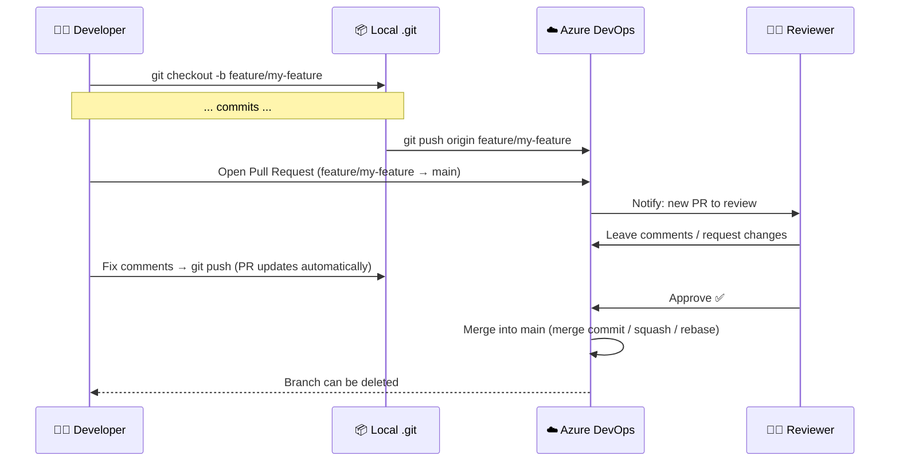
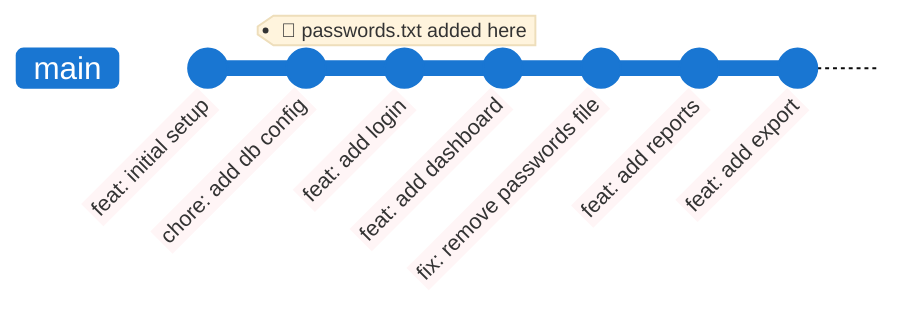
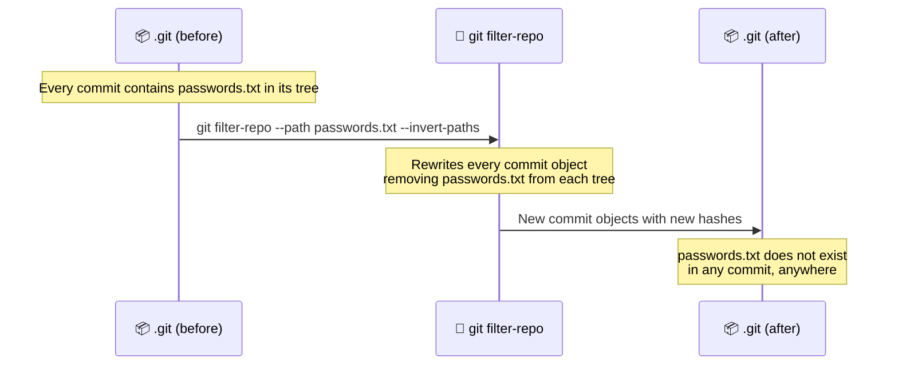
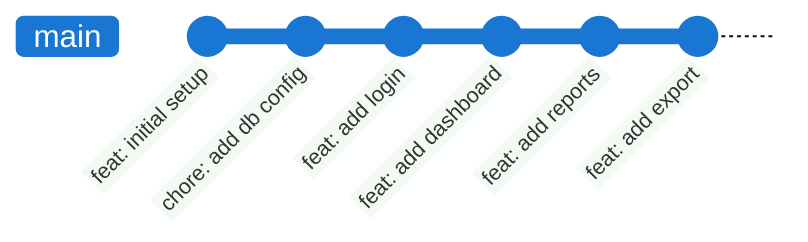
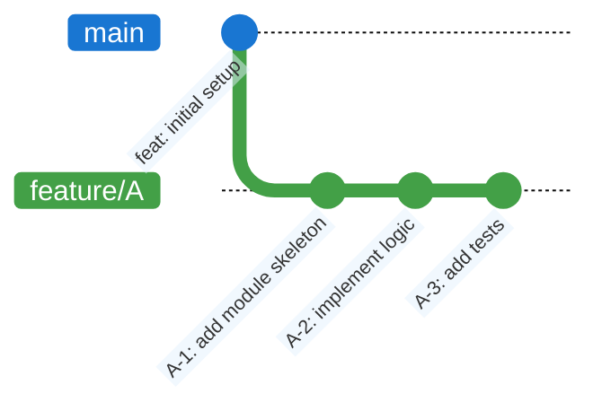
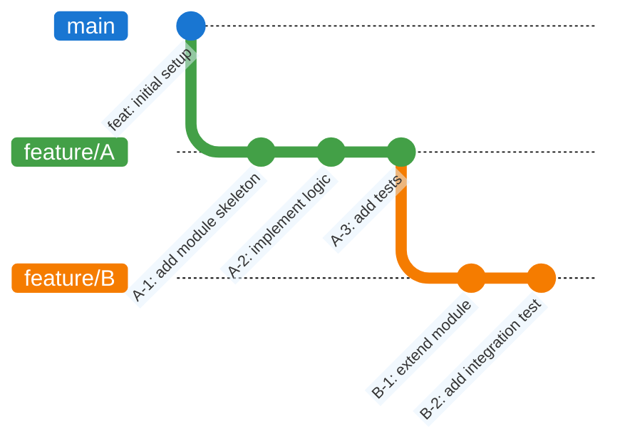
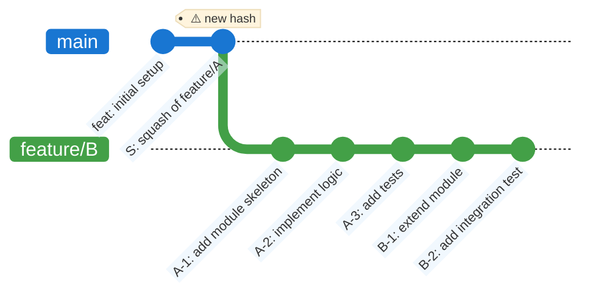
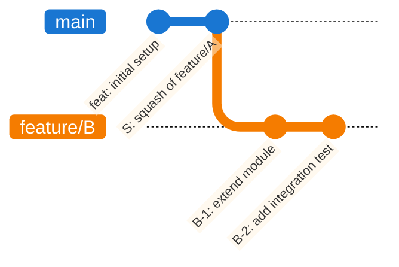
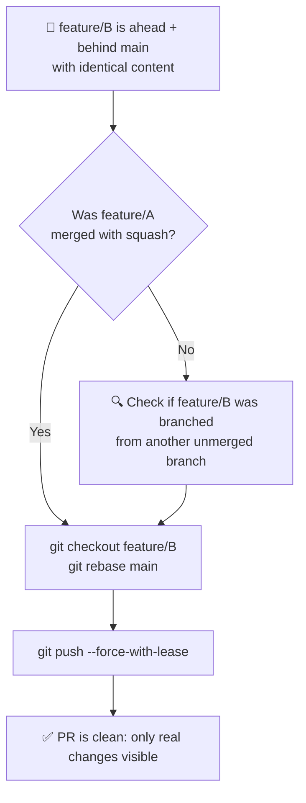

# Exercise 6: Pull Requests, History Purge & the Squash Merge Trap

## Goal

Understand the Pull Request workflow in Azure DevOps, and master two common advanced scenarios: purging a sensitive file from the full Git history when you no longer know which commit introduced it, and diagnosing the "ahead + behind on identical content" problem caused by improper use of squash merges.

> 💡 **Tip**: After every meaningful change, run:
> 
> ```bash
> git status
> git log --oneline --graph --all
> ```

---

## Part 1 — Pull Requests

### What is a Pull Request?

A **Pull Request (PR)** is not a Git concept — it is a feature of hosting platforms (Azure DevOps, GitHub, GitLab). It is a formal request to merge a branch into another, wrapped in a **review and approval workflow**.

The name is slightly misleading: there is no `git pull` involved from the author's side. The platform is asking the team to *review and pull* the changes into the target branch.



---

### The PR Lifecycle in Azure DevOps

#### 1. Push the branch

```bash
git checkout -b feature/my-feature
# ... make commits ...
git push origin feature/my-feature
```

Azure DevOps detects the new branch and shows a **"Create a pull request"** banner on the repository page.

#### 2. Open the PR

In ADO: **Repos → Pull Requests → New Pull Request**

| Field             | Guidance                                                             |
| ----------------- | -------------------------------------------------------------------- |
| **Title**         | Follow Conventional Commits style: `feat(module): short description` |
| **Description**   | Explain *why*, link to the work item, list what was changed          |
| **Target branch** | Usually `main` or `develop`                                          |
| **Reviewers**     | Add at least one — most teams require it for merge                   |
| **Work items**    | Link the ADO task/story to close it automatically on merge           |

#### 3. Review

Reviewers can comment on individual lines, request changes, or approve. The author pushes new commits to address feedback — the PR updates automatically without reopening.

#### 4. Merge strategies in ADO

When completing the PR, ADO offers three strategies:

| Strategy                    | What it does                                 | Local equivalent                     | History shape                              |
| --------------------------- | -------------------------------------------- | ------------------------------------ | ------------------------------------------ |
| **Merge commit**            | Creates a merge commit with two parents      | `git merge --no-ff`                  | Non-linear ✅ evidence of the branch        |
| **Squash commit**           | Collapses all PR commits into one new commit | `git merge --squash && git commit`   | Linear, but ⚠️ new hash                    |
| **Rebase and fast-forward** | Replays commits one by one on top of target  | `git rebase` + `git merge --ff-only` | Linear, original commit messages preserved |

> 💡 **Which one to choose?** Discuss as a team and stick to one convention. Mixing strategies — especially mixing squash with other methods — is the root cause of the problem described in Case 2 below.

#### 5. Branch policies (best practices)

Azure DevOps lets you enforce rules on protected branches (`main`, `develop`, etc):

- **Minimum number of reviewers** — require at least 1 approval before merge
- **Linked work items** — require a task to be linked
- **Build validation** — run CI pipelines automatically on each PR push; block merge if they fail
- **Comment resolution** — block merge until all comments are resolved
- **Delete source branch after merging** — always enable this; see Case 2

---

## Notable Case 1 — Purging a Deleted File from History

### The scenario

A developer accidentally committed a file containing credentials or secrets (`passwords.txt`). A few commits later, they deleted it with `git rm` and committed the deletion. The file no longer exists in the working directory — but it is **still fully readable in the Git history**. Anyone who clones the repository can recover it with `git show <commit>:passwords.txt`.

The additional complication: time has passed, several commits have been made since, and **nobody remembers which commit first introduced the file**.



### Setup

```bash
setup-exercise6-case1.bat
cd ex6-case1
git log --oneline --graph --all
```

---

### Step 1 — Find which commit introduced the file

The file is gone from disk. To find every commit that ever touched it, use `--all` (search all branches) and `--full-history` (do not simplify history, show even merge paths):

```bash
git log --all --full-history --oneline -- passwords.txt
```

**Expected output**:

```
a3f8c21 fix: remove passwords file
7b2e109 feat: add login
```

The **bottom entry** is the oldest — that is the commit where `passwords.txt` was first introduced. The top entry is where it was deleted. Copy the hash of the introduction commit (`7b2e109` in this example).

> 💡 The `--` separator tells Git that everything after it is a file path, not a branch name. This is essential when searching for a file that no longer exists.

You can also inspect the file as it existed at that commit, to confirm it is the right one:

```bash
git show 7b2e109:passwords.txt
```

---

### Step 2 — Purge the file from the entire history

A simple `git rm` + commit only removes the file going forward. The old commits still contain it. To erase it from every commit in history, use **`git filter-repo`**.

Install it if not already available:

```bash
pip install git-filter-repo
```

Then run:

```bash
git filter-repo --path passwords.txt --invert-paths --force
```

`--path passwords.txt` selects the file. `--invert-paths` means "keep everything **except** this path". `--force` is required if the repository was cloned (git-filter-repo is cautious by default).



---

### Step 3 — Verify the purge

```bash
git log --all --full-history --oneline -- passwords.txt
```

**Expected output**: *(empty)* — no commit references the file anymore.

Try to show the file at the old hash:

```bash
git show 7b2e109:passwords.txt
```

**Expected output**:

```
fatal: Path 'passwords.txt' does not exist in '7b2e109'
```

> ⚠️ Note: after `git filter-repo` all commit hashes change, because each commit object is rewritten. The old hash `7b2e109` no longer exists — Git will tell you the object is unknown.

Run the log again to see the new, clean history:

```bash
git log --oneline --graph --all
```



The `fix: remove passwords file` commit also disappears — it no longer has any purpose and `git filter-repo` removes it automatically (since removing an already-absent file produces an empty diff).

---

### Step 4 — Push to remote

Because all hashes have changed, a normal `git push` will be rejected. A force-push is required:

```bash
git push origin --force --all
git push origin --force --tags
```

> ⚠️ **Coordinate with your team before force-pushing.** Everyone who has cloned the repository must run `git fetch --all` and then reset their local branches to the new remote refs. Old clones still contain the secret in their local `.git` — they must be re-cloned or explicitly cleaned. If the repository was public at any point, assume the secret is compromised and rotate it regardless.

---

## Notable Case 2 — The Squash Merge Trap

### The scenario

This is one of the most confusing situations in day-to-day Git usage. Two branches contain **identical file content**, yet Azure DevOps shows one branch as both **N commits ahead** and **M commits behind** the other. Attempting to open a PR results in a diff that shows nothing changed — yet Git insists the branches are different.

The root cause is almost always: **inconsistent use of squash merges**.

### How it happens — step by step

A developer creates `feature/A` from `main` and makes three commits.



Before `feature/A` is merged, a second developer branches `feature/B` from `feature/A` to build on top of its work:



`feature/A` is completed and merged into `main` via a PR — **using the Squash strategy**. Azure DevOps collapses A-1, A-2, and A-3 into a single new commit `S` with a **brand new hash**:



Now the situation is broken. From Git's perspective:

- `main` has commit `S` — which `feature/B` does **not** have → `feature/B` is **behind** main
- `feature/B` has commits `A-1`, `A-2`, `A-3` — which `main` does **not** have → `feature/B` is **ahead** of main

Yet the files are identical. Git compares by **commit hash**, not by file content. `S` and `{A-1, A-2, A-3}` produce the same tree, but they are completely different objects in the graph.

### What you see in Azure DevOps

When you open a PR from `feature/B` to `main`:

```
feature/B is 3 commits ahead, 1 commit behind main
```

The **Files** tab of the PR shows only the diff of B-1 and B-2 (which is the real change). But the **Commits** tab lists A-1, A-2, A-3 as "incoming" commits — which ADO cannot automatically resolve, since their squash equivalent `S` is already on main with a different hash.

If left unresolved, the merge will either fail or introduce a confusing merge commit that re-applies already-present changes.

---

### The fix

The correct procedure is to **rebase `feature/B` onto the current `main`**. This replays B-1 and B-2 on top of `S`, discarding A-1, A-2, A-3 (whose content is already in `S`):

```bash
git checkout feature/B
git rebase main
```



After the rebase, force-push `feature/B`:

```bash
git push origin feature/B --force-with-lease
```

The PR now correctly shows: **2 commits ahead, 0 commits behind**. The Files tab shows only the real changes from B-1 and B-2.

> ⚠️ `--force-with-lease` is safer than `--force`: it aborts the push if someone else has pushed to the same branch in the meantime, preventing you from overwriting their work.

---

### How to prevent it — the two rules

The problem arises from **breaking the chain** between a dependent branch and its parent. Two simple rules prevent it entirely:

**Rule 1 — Be consistent with the merge strategy.** If your team uses squash, use squash for every PR. Mixing squash with merge commits makes history impossible to reason about.

**Rule 2 — Never branch from a feature branch that has not yet been merged.** Always branch from `main` (or your integration branch). If you need work from an unmerged branch, use cherry-pick for specific commits, or wait for the PR to be merged first.

If Rule 2 is violated by necessity (e.g. time pressure), document the dependency in the PR description and rebase `feature/B` onto `main` immediately after `feature/A` is merged.



---

### Exercise — Reproduce and fix the squash merge trap

#### Setup

```bash
setup-exercise6-case2.bat
cd ex6-case2
git log --oneline --graph --all
```

You will see `main` with a squash commit `S`, and `feature/B` still carrying the original individual commits from `feature/A`.

#### Reproduce the problem

Check the state ADO would show:

```bash
git checkout main
git log --oneline          # shows: feat: initial setup, S: squash of feature/A

git checkout feature/B
git log --oneline          # shows: A-1, A-2, A-3, B-1, B-2 on top of feat: initial setup
```

Simulate what ADO computes (commits in feature/B not in main, and vice versa):

```bash
# commits that feature/B has but main does not:
git log main..feature/B --oneline

# commits that main has but feature/B does not:
git log feature/B..main --oneline
```

**Expected output**: both commands return results — the branch is simultaneously ahead and behind.

Inspect the files on both branches:

```bash
git checkout main
cat module.txt

git checkout feature/B
cat module.txt
```

The `module.txt` content from `feature/A`'s work is **identical** on both branches. Git's graph disagrees; the files agree.

#### Apply the fix

```bash
git checkout feature/B
git rebase main
```

Verify the fix:

```bash
# commits that feature/B has but main does not (should be only B-1 and B-2):
git log main..feature/B --oneline

# commits that main has but feature/B does not (should be empty):
git log feature/B..main --oneline
```

```bash
git log --oneline --graph --all
```


**What to observe**: `feature/B` now starts from `S`. A-1, A-2 and A-3 are gone — their content is already in `S`, and the rebase was smart enough not to reapply them. Only the genuinely new work (B-1 and B-2) remains.

---

## Command Summary

| Command                                            | Description                                                    |
| -------------------------------------------------- | -------------------------------------------------------------- |
| `git log --all --full-history --oneline -- <file>` | Find every commit that ever touched a file (even deleted ones) |
| `git show <hash>:<file>`                           | View a file as it existed at a specific commit                 |
| `git filter-repo --path <file> --invert-paths`     | Purge a file from the entire history                           |
| `git push origin --force --all`                    | Force-push all branches after a history rewrite                |
| `git push origin --force --tags`                   | Force-push all tags after a history rewrite                    |
| `git log main..feature/B --oneline`                | Commits in feature/B not yet in main (ahead)                   |
| `git log feature/B..main --oneline`                | Commits in main not in feature/B (behind)                      |
| `git rebase main`                                  | Replay current branch on top of main                           |
| `git push origin <branch> --force-with-lease`      | Force-push safely (aborts if remote was updated)               |
