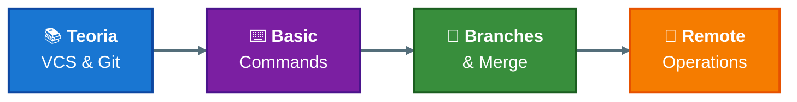

# Corso Git - beanTech

## Panoramica del Corso

Questo corso introduce Git e il version control in **tre sessioni da un'ora** ciascuna.

---

## Sessione 1: Git Basics (1 ora) ← **Questa sessione**

| Tempo | Contenuto |
|-------|-----------|
| 15 min | Teoria: VCS e Git Basics |
| 15 min | Esercitazione: Comandi Base |
| 15 min | Esercitazione: Branches |
| 15 min | Esercitazione: Remote Operations |

---

## Struttura Repository

```
corso-git/
├── README.md                          # Questo file
├── 01-teoria/
│   └── 01-vcs-git-basics.md          # Teoria VCS e Git
└── 02-esercitazioni/
    ├── 01-basic-commands/
    │   ├── guida.md                   # Guida esercitazione
    │   └── progetto.txt               # File per esercitarsi
    ├── 02-branches/
    │   ├── guida.md
    │   └── feature.txt
    └── 03-remote-operations/
        ├── guida.md
        └── collaborazione.txt
```

---

## Flusso del Corso



---

## Prossime Sessioni (Future)

- **Sessione 2**: Git Avanzato (rebase, cherry-pick, stash)
- **Sessione 3**: Workflow e Best Practices

---

## Come Iniziare

1. Leggi la [teoria VCS e Git](01-teoria/01-vcs-git-basics.md)
2. Segui le esercitazioni in ordine:
   - [Basic Commands](02-esercitazioni/01-basic-commands/guida.md)
   - [Branches](02-esercitazioni/02-branches/guida.md)
   - [Remote Operations](02-esercitazioni/03-remote-operations/guida.md)